## Luminosity Windows 11 Theme Pack (Beta)
Early access to the Luminosity updates. They may contain issues and messy code. Luminosity is a theme pack for Windhawk's Windows 11 Styler mods.

# ⚠️ Beta Warning
**This is a Beta release.**
While the themes have been tested, they are not final. Expect issues, unfinished features, and visual inconsistencies. Feedback is appreciated!

Theme `yaml` is up to date, but README information likely isn't!


## ✨ Main `README` Rewrite ✨

The main `README.md` has been rewritten to make the entire theme available on a single page! Configs for each styler now have its own toggle; just scroll down and find what you need. No more jumping in and out of folders! (I hated that.) **Currently have some missing, outdated and inconsistent documentation**, I'll improve it as I update the themes.

### Main Changes:

- Set outdated information to "[Work in Progress]"
- Each theme now have (or should have) its own information, no redundancies
- Removed old changelog; might return with better organization

## ✨ Luminosity Taskbar 1.2 ✨
<details>
<summary>(click to expand)</summary>
	
### General Changes:

- Multiple `TaskbarFrame` fixes by [**m417z**](https://github.com/m417z)
    - Now compatible with multiple taskbar setups!! (multiple displays)
- Fixed missing Background in some elements
- Better documentation and guides
- Better settings; easier to change thingies
- Revamped Task View and Alt+Tab
    - New visuals (inside limitations)
    - Better Virtual Desktops bar width behavior
- Hover effects from [Fluid](https://github.com/ramensoftware/windows-11-start-menu-styling-guide/tree/main/Themes/Fluid) on Window Preview buttons
- `SystemTray` fixes and simplification
- Reorganized some target placment
- Specified some vague targets
- Overflow icon now have styling
- Removed gap between widget and taskbar icons for extra space
    - Can be disabled
    - Not available for Classic variant by default
- Restored Snap Layouts Bar position to make the top more accessible
- Basic styling to Input Switcher
    - Couldn’t find targets to make buttons rounded as well

**Dock**

- Neat top gap idea I got from a [Reddit post from u/OCometa](https://www.reddit.com/r/Windhawk/comments/1t3x8n9/how_can_i_nudge_the_taskbar_a_few_pixels_down_or/) to better separate maximized window and dock
- Added a small gap between taskbar icons and system tray to access Right-Click Menu.
</details>

## ✨ Basic styling for the [redesigned Windows 11 Start menu](https://microsoft.design/articles/start-fresh-redesigning-windows-start-menu/)! ✨

Choose the version `0.3`! should also be compatible with the old Start Menu and will replace `0.2` when ready.

---

## Roadmap
<details>
<summary>(click to expand)</summary>

This is a draft roadmap of some things I want to do. They won't be done in order! Some ideas are still theoretical/experimental and might not be possible because of unknown limitations.

### Documentation
- [x]  Single-page `README`
- [ ]  Complete missing sections
- [ ]  Make and add custom icons instead of emojis (I like icons)
- [ ]  Update screenshots

### Taskbar
I belive the taskbar is in its best state at the moment, so I'll shift to other parts of the pack instead. The next big update might be bringing more changes, and options that users can just drop into the `yaml` after the main configuration. Some planned optional ideas are:

- Bigger window previews
- Bigger buttons for various things
- Task View and Alt+Tab variations

### Start Menu
- [ ]  Finish Start Menu 0.3
  - [ ]  Search Menu buttons `CommonStates` styling
  - [ ]  Right companion toggle button
  - [ ]  View options
  - [ ]  Category items
  - [ ]  Category name
  - [ ]  Category return button
  - [ ]  Category > Category Folder > Scroll not working

### Notification Center
- [x]  Fix notification banner styling (new Windows update broke it)
- [ ]  Add Fluid's animations
- [ ]  Media transporter too big on smaller resolutions
- [ ]  Focus session icons offset vertically
- [ ]  Apply animations to buttons (NC only)
- [ ]  Fix AC Return buttons weird radius
- [ ]  Jumplists Menu animations

### File Explorer
- [ ]  Add Fluid's Animations to many items
- [ ]  Better, optional look for non-Translucent Windows users
- [ ]  Hopefully change Right-Click menus background (low hopes on this one)
</details>

---

## Credits

- [WindowGlass](https://github.com/Nathaniel4JC/Windows-11-Taskbar-Styler/tree/main/Themes/WindowGlass) - A few targets
- [Fluid](https://github.com/ramensoftware/windows-11-start-menu-styling-guide/tree/main/Themes/Fluid) - Right-Click animations and `@CommonStates` effects

---

## Installation Guide

<details>
<summary>Content to Install (click to expand)</summary>

To apply the theme, you will need:
- [Windhawk](https://windhawk.net/) (Of course)

### Required Windhawk Mods
**Taskbar**
- [Windows 11 Taskbar Styler](https://windhawk.net/mods/windows-11-taskbar-styler)
  
  **Required for Compact Taskbar**
  - [Taskbar Labels for Windows 11](https://windhawk.net/mods/taskbar-labels)
  - [Taskbar Clock Customization](https://windhawk.net/mods/taskbar-clock-customization)

**Start Menu**
- [Windows 11 Start Menu Styler](https://windhawk.net/mods/windows-11-start-menu-styler)

**Notification / Action Center**
- [Windows 11 Notification Center Styler](https://windhawk.net/mods/windows-11-notification-center-styler)

**File Explerer**
- [Windows 11 File Explorer Styler](https://windhawk.net/mods/windows-11-file-explorer-styler)

**Recommended**
- [Translucent Windows](https://windhawk.net/mods/translucent-windows) (use Mica or MicaAlt)
</details>

---

# Introduction

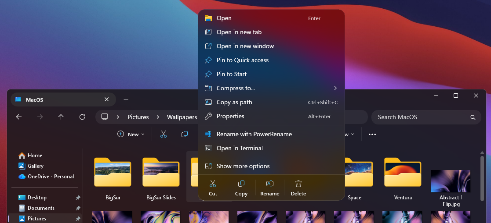

**Luminosity** is inspired from Windows's native Acrylic, using the maximum `TintLuminosityOpacity` value as its backdrop and more rounded UI elements.

It's meant to work well on dark windows, with **Mica** or **MicaAlt** backdrops, with or without the **Translucent Windows** mod.

---

# Themes

## 💻 Shared Guides
<details>
<summary>(click to expand)</summary>

  ### Custom Menu Animation Settings
  <details>
  <summary>(click to expand guide)</summary>

  To customize the animations, look for this style constant:
  ```
  AnimationSettings=IsStaggeringEnabled="True" FromHorizontalOffset="-50" FromVerticalOffset="50"
  ```

  - For all items to display immediately, set `IsStaggeringEnabled=` from `"True"` to `"False"`.

  - `FromHorizontalOffset` and `FromVerticalOffset` are the directions where the items come from.
    - Horizontal **Positive** values is **Right**, **Negative** is **Left**.
    - Vertical **Positive** values is **Down**, **Negative** is **Up**.
  </details>

  &nbsp;

  ### Backgrounds Guide (Work in Progress)
  <details>
  <summary>(click to expand guide)</summary>

  To customize the background, locate one of these lines depending on your version:

  **Old Background** (in case you want, but has issues)

  ```yaml
  mbg=<AcrylicBrush TintColor="{ThemeResource CardStrokeColorDefaultSolid}" FallbackColor="{ThemeResource CardStrokeColorDefaultSolid}" TintOpacity="0.0" TintLuminosityOpacity="1.0" Opacity="1"/>
  ```

  **New Background**
    
  ```yaml
    - mbg=<WindhawkBlur BlurAmount="30" TintColor="{ThemeResource CardStrokeColorDefaultSolid}" TintOpacity="0.0" TintLuminosityOpacity="1.0" TintSaturation="1.0" NoiseDensity="1.0" NoiseOpacity="0.1" />
  ```

  **Parameters Explanation**

  - `TintColor`: Can be a valid `ThemeResource`, hex color in #AARRGGBB or #RRGGBB format that is applied to the blur.
  - `TintOpacity`: Opacity of the `TintColor`, overrides the alpha of TintColor.
  - `TintLuminosityOpacity`: Lowering this value makes it more transparent. Range: 0.0 to 1.0.
    
  - `BlurAmount`: Radius of blur effect (set to 30 to mimic Acrylic).
  - `TintSaturation`: Controls the saturation of the blurred content. 1.0 is unchanged, 0.0 is fully desaturated (grayscale).
  - `NoiseOpacity`: Adds a procedural noise texture overlay. Controls how visible the noise is (0.0 to 1.0).
  - `NoiseDensity`: Controls the granularity of the noise texture (defaults to 1.0).

  [Official Documentation](https://github.com/ramensoftware/windows-11-taskbar-styling-guide/tree/main?tab=readme-ov-file#windhawkblur-effect-as-color)


  To apply backdrops from other themes, replace the content after `mbg=`.
  </details>
</details>

&nbsp;

## **🍫 Taskbar** | **1.2.1** | ✅ Working Fine

<details>
<summary>(click to expand)</summary>

  <details>
  <summary>Changelog</summary>

  **Added**

  - Nothing 🤓

  **Fixed**

  - Crevron button (tray icons overflow) left side too wide
  </details>

  ---

  ## Options

  ### Dock

  

  - Docks are cool.

  ### Classic

  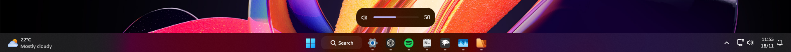

  - Meant to cause minimal disruption for users who prefer the classic Taskbar placement.

  ### Compact

  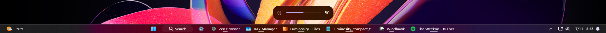

  - Meant to be used with **Taskbar Labels for Windows 11**, using the **Centered Running Indicator** style, and **Taskbar Clock Customization**. Otherwise, you will experience visual issues.

  ---

  ### Mods Guide

  To apply the same settings as mine, follow these steps:

  * Open the **Taskbar Labels for Windows 11** and **Taskbar Clock Customization** mods in Windhawk.
  * Go to the "Settings" tab and select "Textual mode".
  * Copy the content below to the text box and click "Save settings".

  **Taskbar Labels for Windows 11**
  <details>
  <summary>Click to expand mod settings</summary>

  ```yaml
  mode: labelsWithoutCombining
  taskbarItemWidth: 0
  runningIndicatorStyle: centerDynamic
  progressIndicatorStyle: centerDynamic
  excludedPrograms:
    - excluded1.exe
  minimumTaskbarItemWidth: 50
  maximumTaskbarItemWidth: 176
  fontSize: 12
  fontFamily: ''
  textTrimming: characterEllipsis
  leftAndRightPaddingSize: 8
  spaceBetweenIconAndLabel: 8
  runningIndicatorHeight: 0
  runningIndicatorVerticalOffset: 0
  alwaysShowThumbnailLabels: 0
  labelForSingleItem: '%name%'
  labelForMultipleItems: '[%amount%] %name%'
  ```
  </details>

  &nbsp;

  **Taskbar Clock Customization**
  <details>
  <summary>Click to expand mod settings</summary>

  ```yaml
  ShowSeconds: 1
  TimeFormat: ''
  DateFormat: ''
  WeekdayFormat: dddd
  WeekdayFormatCustom: Sun, Mon, Tue, Wed, Thu, Fri, Sat
  TopLine: '%date%   %time%'
  BottomLine: ''
  MiddleLine: '%weekday%'
  TooltipLine: ''
  TooltipLineMode: append
  Width: 180
  Height: 60
  MaxWidth: 0
  TextSpacing: 0
  DataCollection:
    NetworkMetricsFormat: mbs
    NetworkMetricsFixedDecimals: -1
    PercentageFormat: spacePaddingAndSymbol
    UpdateInterval: 1
    NetworkAdapterName: ''
    GpuAdapterName: ''
  MediaPlayer:
    IgnoredPlayers:
      - ''
    MaxLength: 28
    NoMediaText: No media
    RemoveBrackets: 0
  WebContentWeatherLocation: ''
  WebContentWeatherFormat: '%c 🌡️%t 🌬️%w'
  WebContentWeatherUnits: autoDetect
  WebContentsItems:
    - Url: https://rss.nytimes.com/services/xml/rss/nyt/World.xml
      BlockStart: <item>
      Start: <title>
      End: </title>
      ContentMode: xmlHtml
      SearchReplace:
        - Search: ''
          Replace: ''
      MaxLength: 28
  WebContentsUpdateInterval: 10
  TimeZones:
    - Eastern Standard Time
  TimeStyle:
    Hidden: 0
    TextColor: ''
    TextAlignment: ''
    FontSize: 0
    FontFamily: ''
    FontWeight: ''
    FontStyle: ''
    FontStretch: ''
    CharacterSpacing: 0
  DateStyle:
    Hidden: 1
    TextColor: ''
    TextAlignment: ''
    FontSize: 0
    FontFamily: ''
    FontWeight: ''
    FontStyle: ''
    FontStretch: ''
    CharacterSpacing: 0
  oldTaskbarOnWin11: 0
  DataCollectionUpdateInterval: 1
  ```
  </details>

  &nbsp;

  ---

  ## General Information

  The theme changes the following elements:

  - Taskbar Frame
  - Taskbar icon borders
  - Taskbar icon sizes (compact version)
  - Search icon with label
  - Search box
  - Taskbar Overflow Flyout
  - System Tray
      - Chevron icon border
      - Software icon border
      - Microphone icon border
      - Spacing between element groups
      - Tray Overflow Flyout
  - Volume bar
  - Window Preview Flyout
  - Alt+Tab
  - Task View
  - Snap Bar and Picker
  - Context menus (with animations)
  - Tooltips
  - Removed drop shadows

  <details>
  <summary>Screenshots (Click to expand)</summary>

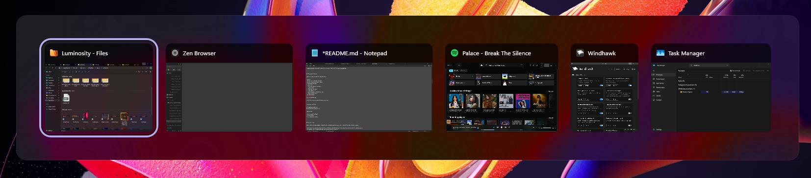


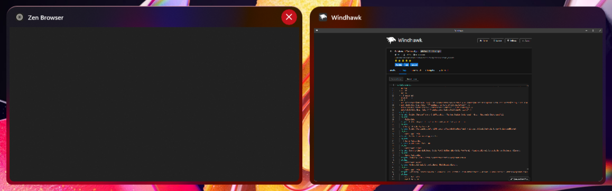


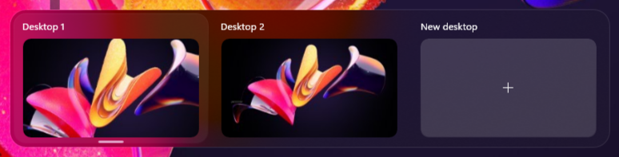


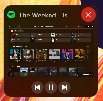


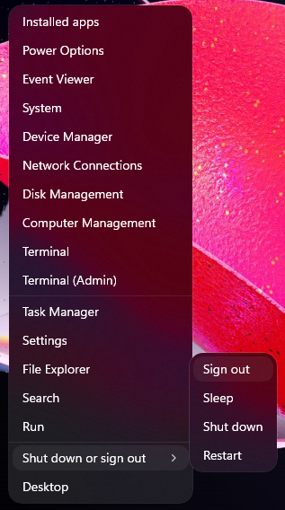

  </details>

  ---

  ## Guides

  ### Custom Dock Width

  The dock's width changes depending on your **screen resolution** using **horizontal margins**. If you want a custom width, follow this guide.

  <details>
  <summary>(Click to expand guide)</summary>

  Locate and edit these `styleConstants` values:

    - DockMargin
    - DockMarginFix

  The examples are for a **full length dock** (corner to corner).

  ## 1. Main taskbar width

  `DockMargin=250`

  This controls the main dock width.

  - Smaller value = wider dock
  - Larger value = narrower dock

  Example: `DockMargin=5`

  &nbsp;

  ## 2. Background alignment fix

  `DockMarginFix=500`

  This value must always equal: `DockMargin × 2`

  Example:

  If: `DockMargin=5`

  Then: `DockMarginFix=10`
  </details>

  &nbsp;

  ### Disabling Dock Top Gap

  Set the following style constants to these values:

  <details>
  <summary>(Click to expand guide)</summary>

  ```yaml
    - DockHeight=53
    - DockTopGap=0
    - DockTrayMarginUp=-2
    - DockTrayMarginDown=4
  ```
  </details>

  &nbsp;

  ### Left Taskbar Alignment Fix

  <details>
  <summary>Click to expand guide</summary>

  When using **Left Taskbar Alignment** with Widget, remove the **minus sign** (`-`) from `WidgetGap=-`.

  Like this: `WidgetGap=`

  **Note:** The **Classic** variant is compatible by default.
  </details>

  &nbsp;

  ### Taskbar height and icon size Compatibility

  <details>
  <summary>Click to expand guide</summary>

  You can edit the constant `Height=58`'s value, but doing so requires manually adjusting `DockTrayMarginUp` and `DockTrayMarginDown`.

  Removing the last target allows external mods to change the height, though the manual adjustments listed above are still required.

  ```yaml
    - target: Taskbar.TaskbarFrame
      styles:
        - Height=$DockHeight
  ```
  </details>

  &nbsp;

  ---

  ## Known Issues

  I didn't know how to fix these. I couldn't find the correct target names, or I'm not sure if they can even be changed/fixed.

  - **Left Taskbar Alignment (Dock/Compact):** **Left Taskbar Alignment** is not compatible by default. Refer to the [Left Taskbar Alignment Fix Guide](#left-taskbar-alignment-fix).
  - **Taskbar height and icon size Mod (Dock):** `Taskbar height and icon size` is not compatible, but you can edit manually. Refer to [Taskbar height and icon size Compatibility Guide](#taskbar-height-and-icon-size-compatibility).
  - **Icon Hitboxes (Dock):** The Taskbar's rounded corners slightly limit the icon hitbox on the **top and bottom**, which makes it **impossible to minimize windows by clicking in those areas**.
  - **SearchBox (Dock/Classic):** Has **mismatched look and position** when typing.
  - **SearchBox (Compact):** Has incorrect styling and positioning in the Compact version.
  - **Widget/Weather (Compact):** The bottom text line has incorrect placement (renders off-screen).

  ---

  ## Theme selection

  The theme is integrated into the mod and can be selected directly from the mod's
  settings:

  * Open the Windows 11 Taskbar Styler mod in Windhawk.
  * Go to the "Settings" tab.
  * Select the theme and save the settings.

  ## Manual installation

  The theme styles can also be imported manually. To do that, follow these steps:

  * Open the Windows 11 Taskbar Styler mod in Windhawk.
  * Go to the "Settings" tab and select "Textual mode".
  * Copy the content below to the text box and click "Save settings".

  ---

  ### Dock

  <details>
  <summary>Content to import (click to expand)</summary>

  ```yaml
  styleConstants:
    - DockMargin=250
    - DockMarginFix=500
    - DockHeight=58
    - DockTopGap=5
    - DockTrayMarginUp=1
    - DockTrayMarginDown=1
    - WidgetGap=-
    - AccentColor=<SolidColorBrush Color="{ThemeResource SystemAccentColorLight2}" Opacity="1.0" />
    - AnimationSettings=IsStaggeringEnabled="True" FromHorizontalOffset="-50" FromVerticalOffset="50"
    - mbg=<WindhawkBlur BlurAmount="30" TintColor="{ThemeResource CardStrokeColorDefaultSolid}" TintOpacity="0.0" TintLuminosityOpacity="1.0" TintSaturation="1.0" NoiseDensity="1.0" NoiseOpacity="0.1" />
    - bcr=10
    - wcr=20
    - mcr=15
    - t=Transparent
    - bb=#20FFFFFF
    - bt=1
    - nbb=<LinearGradientBrush x:Key="ShellTaskbarItemGradientStrokeColorSecondaryBrush" MappingMode="Absolute" StartPoint="0,0" EndPoint="0,3"><LinearGradientBrush.GradientStops><GradientStop Offset="0.33" Color="#1AFFFFFF" /><GradientStop Offset="1" Color="#0FFFFFFF" /></LinearGradientBrush.GradientStops></LinearGradientBrush>
    - nbt=<SolidColorBrush Color="{ThemeResource ControlFillColorDefault}" />
    - nbth=<SolidColorBrush Color="{ThemeResource ControlFillColorSecondary}" />
    - nbtp=<SolidColorBrush Color="{ThemeResource ControlFillColorTertiary}" />
  controlStyles:
    - target: Taskbar.TaskbarFrame > Grid#RootGrid > Taskbar.TaskbarBackground > Grid > Rectangle#BackgroundFill
      styles:
        - Fill:=$mbg
    - target: Taskbar.TaskListButtonPanel#ExperienceToggleButtonRootPanel > Windows.UI.Xaml.Controls.Border#BackgroundElement
      styles:
        - CornerRadius=$bcr
    - target: Taskbar.ExperienceToggleButton
      styles:
        - CornerRadius=$bcr
    - target: Taskbar.TaskListButton
      styles:
        - CornerRadius=$bcr
    - target: SearchUx.SearchUI.SearchButtonRootGrid#SearchBoxButtonRootPanel > Windows.UI.Xaml.Controls.Border#BackgroundElement
      styles:
        - CornerRadius=$bcr
    - target: Windows.UI.Xaml.Controls.Border#SearchPillBackgroundElement
      styles:
        - CornerRadius=$bcr
    - target: Windows.UI.Xaml.Controls.Border#MultiWindowElement
      styles:
        - CornerRadius=$bcr
    - target: SystemTray.ChevronIconView > Windows.UI.Xaml.Controls.Grid#ContainerGrid > Windows.UI.Xaml.Controls.Border#BackgroundBorder
      styles:
        - CornerRadius=$bcr
        - Margin=2,4,2,4
    - target: SystemTray.NotifyIconView > Windows.UI.Xaml.Controls.Grid#ContainerGrid > Windows.UI.Xaml.Controls.Border#BackgroundBorder
      styles:
        - CornerRadius=$bcr
        - Margin=2,4,2,4
    - target: SystemTray.IconView#SystemTrayIcon > Windows.UI.Xaml.Controls.Grid#ContainerGrid > Windows.UI.Xaml.Controls.Border#BackgroundBorder
      styles:
        - CornerRadius=$bcr
        - Margin=2,4,2,4
    - target: SystemTray.OmniButton#ControlCenterButton > Windows.UI.Xaml.Controls.Grid > Windows.UI.Xaml.Controls.Border#BackgroundBorder
      styles:
        - CornerRadius=$bcr
        - Margin=2,4,2,4
    - target: SystemTray.OmniButton#NotificationCenterButton > Windows.UI.Xaml.Controls.Grid > Windows.UI.Xaml.Controls.Border#BackgroundBorder
      styles:
        - CornerRadius=$bcr
        - Margin=2,4,2,4
    - target: Border#OverflowFlyoutBackgroundBorder
      styles:
        - Background:=$mbg
        - CornerRadius:=$wcr
        - BorderThickness=$bt
        - BorderBrush=$bb
        - Shadow:=
    - target: Taskbar.OverflowToggleButton#OverflowButton > Taskbar.TaskListButtonPanel#OverflowToggleButtonRootPanel > Windows.UI.Xaml.Controls.Border#BackgroundElement
      styles:
        - CornerRadius=$bcr
    - target: Windows.UI.Xaml.Controls.Grid#ConfirmatorMainGrid
      styles:
        - Background:=$mbg
        - CornerRadius=$wcr
        - BorderThickness=$bt
        - BorderBrush=$bb
        - Shadow:=
    - target: Windows.UI.Xaml.Shapes.Rectangle#HorizontalTrackRect
      styles:
        - Fill:=#10FFFFFF
    - target: WindowsInternal.ComposableShell.Experiences.TextInput.Common.InputSwitcher > ContentControl > ContentPresenter > Grid
      styles:
        - Background:=$mbg
        - CornerRadius=$wcr
        - BorderThickness=$bt
        - BorderBrush=$bb
        - Shadow:=
    - target: WindowsInternal.ComposableShell.Experiences.TextInput.Common.InputSwitcher > ContentControl > ContentPresenter > Grid > Grid
      styles:
        - Background:=$t
    - target: Taskbar.TaskbarBackground#HoverFlyoutBackgroundControl > Grid > Rectangle#BackgroundFill
      styles:
        - Fill:=$t
    - target: Windows.UI.Xaml.Controls.Grid#HoverFlyoutGrid > Windows.UI.Xaml.Controls.Border#HoverFlyoutBackground
      styles:
        - Background:=$mbg
        - CornerRadius=$mcr
        - BorderThickness=$bt
        - BorderBrush=$bb
        - Shadow:=
    - target: Taskbar.TaskItemThumbnailView > Grid@CommonStates > Border#BackgroundBorder
      styles:
        - Background=$t
        - CornerRadius=$mcr
        - BorderThickness@Normal=0
        - BorderThickness@PointerOver=0.05,0,0.05,1
        - BorderBrush@Normal=$t
        - BorderBrush@PointerOver:=$AccentColor
    - target: Taskbar.TaskItemThumbnailView > Grid > Button#CloseButton
      styles:
        - CornerRadius=$mcr
    - target: Taskbar.ThumbBarButton#ThumbBarButton > Windows.UI.Xaml.Controls.ContentPresenter#BorderElement@CommonStates
      styles:
        - CornerRadius=16
        - Margin=-1.5
        - Background@Disabled:=$t
        - Background@Normal:=$t
        - Background@PointerOver:=$nbth
        - Background@Pressed:=$nbtp
        - BorderThickness=2
        - BorderBrush@Disabled:=$t
        - BorderBrush@Normal:=$t
        - BorderBrush@PointerOver:=$nbb
        - BorderBrush@Pressed:=$nbb
        - BackgroundSizing=InnerBorderEdge
        - BackgroundTransition:=<BrushTransition Duration="0:0:0.200" />
    - target: Windows.UI.Xaml.Controls.Grid#ModalRootGrid > Windows.UI.Xaml.Controls.Border#BackgroundElement
      styles:
        - Background=$t
        - CornerRadius=$wcr
        - BorderThickness=$bt
        - BorderBrush=$bb
        - Shadow:=
    - target: Windows.UI.Xaml.Controls.Grid#ModalRootGrid > Windows.UI.Xaml.Controls.Border#BackgroundElement > WindowsInternal.ComposableShell.Experiences.Switcher.SwitchItemList
      styles:
        - Background:=$mbg
    - target: WindowsInternal.ComposableShell.Experiences.Switcher.DynamicFlowPanel > WindowsInternal.ComposableShell.Experiences.Switcher.SwitchItemListViewItem > Windows.UI.Xaml.Controls.Grid#Root@CommonStates > Windows.UI.Xaml.Controls.Border#BackgroundBorder
      styles:
        - Background:=#09FFFFFF
        - CornerRadius=$mcr
        - BorderThickness=0.05,1,0.05,0
        - BorderBrush@Normal=$t
        - BorderBrush@PointerOver:=$AccentColor
    - target: WindowsInternal.ComposableShell.Experiences.Switcher.SwitchItemControl > Grid#Root > WindowsInternal.ComposableShell.Experiences.Switcher.SwitchItemThumbnailButton#ThumbnailHost > Windows.UI.Xaml.Controls.Grid#RootGrid
      styles:
        - CornerRadius=$bcr
        - Margin=5
    - target: Windows.UI.Xaml.Controls.Border#BackgroundDimmingLayer
      styles:
        - Background:=$t
    - target: WindowsInternal.ComposableShell.Experiences.Switcher.VirtualDesktopBarElement > Windows.UI.Xaml.Controls.Grid#GridElement > Windows.UI.Xaml.Controls.Border#VirtualDesktopSwitcherBackground
      styles:
        - CornerRadius=$wcr
        - BorderThickness=$bt
        - BorderBrush=$bb
        - Margin=-2,1,-1,2
    - target: WindowsInternal.ComposableShell.Experiences.Switcher.DynamicFlowPanel#DFCPanel > WindowsInternal.ComposableShell.Experiences.Switcher.SwitchItemListViewItem > Windows.UI.Xaml.Controls.Grid#Root@CommonStates > Windows.UI.Xaml.Controls.Border#BackgroundBorder
      styles:
        - Background:=$mbg
        - CornerRadius=$wcr,$wcr,$bcr,$bcr
        - Margin:=-5,0,-5,-5
        - BorderThickness=0.05,1,0.05,0
        - BorderBrush@Normal=$t
        - BorderBrush@PointerOver:=$AccentColor
    - target: WindowsInternal.ComposableShell.Experiences.Switcher.SwitchItemElement > Windows.UI.Xaml.Controls.Grid#RootGrid > Windows.UI.Xaml.Controls.Grid#TitleGrid > Windows.UI.Xaml.Controls.Border#BackgroundBorder
      styles:
        - Background:=$t
    - target: WindowsInternal.ComposableShell.Experiences.Switcher.SwitchItemElement > Windows.UI.Xaml.Controls.Grid#RootGrid > Windows.UI.Xaml.Controls.Grid#TitleGrid > Image#IconImage
      styles:
        - RenderTransform:=<TranslateTransform X="0" Y="1" />
    - target: WindowsInternal.ComposableShell.Experiences.Switcher.SwitchItemElement > Windows.UI.Xaml.Controls.Grid#RootGrid > Windows.UI.Xaml.Controls.Grid#TitleGrid > TextBlock#DisplayName
      styles:
        - RenderTransform:=<TranslateTransform X="0" Y="1" />
    - target: Windows.UI.Xaml.Controls.Button#SwitchItemElementCloseButton > ContentPresenter#ContentPresenter
      styles:
        - CornerRadius=$mcr
        - Margin=5
    - target: Windows.UI.Xaml.Controls.Button#SwitchItemElementCloseButton > ContentPresenter#ContentPresenter > TextBlock
      styles:
        - RenderTransform:=<TranslateTransform X="-0.8" Y="-0.6" />
    - target: WindowsInternal.ComposableShell.Experiences.Switcher.SwitchItemElement > Grid#RootGrid > WindowsInternal.ComposableShell.Experiences.Switcher.SwitchItemThumbnailButton#ThumbnailHost > Grid#RootGrid
      styles:
        - CornerRadius=0
    - target: WindowsInternal.ComposableShell.Experiences.Switcher.VirtualDesktopBarElement#VirtualDesktopBar > Grid > Border
      styles:
        - Background:=$mbg
        - CornerRadius=$wcr
        - BorderThickness=$bt
        - BorderBrush=$bb
        - Margin=-1,2,0,0
    - target: WindowsInternal.ComposableShell.Experiences.Switcher.VirtualDesktopBarElement#VirtualDesktopBar
      styles:
        - Width=Auto
        - HorizontalAlignment=1
    - target: WindowsInternal.ComposableShell.Experiences.Switcher.VirtualDesktopBarElement > Grid > Border
      styles:
        - Background:=$mbg
        - Shadow:=
    - target: WindowsInternal.ComposableShell.Experiences.Switcher.VirtualDesktopElementThemed > Windows.UI.Xaml.Controls.Grid#MainGrid > Windows.UI.Xaml.Controls.Border#MainBorder
      styles:
        - CornerRadius=$mcr
    - target: WindowsInternal.ComposableShell.Experiences.Switcher.VirtualDesktopElementThemed > Windows.UI.Xaml.Controls.Grid#MainGrid > Windows.UI.Xaml.Controls.Border#BorderHighlight
      styles:
        - CornerRadius=$mcr
    - target: WindowsInternal.ComposableShell.Experiences.Switcher.NewVirtualDesktopElementThemed#NewVirtualDesktopButtonThemed > Windows.UI.Xaml.Controls.Grid#MainGrid
      styles:
        - CornerRadius=$mcr
        - BorderThickness=$bt
        - Margin=2
    - target: WindowsInternal.ComposableShell.Experiences.Switcher.NewVirtualDesktopElementThemed#NewVirtualDesktopButtonThemed > Windows.UI.Xaml.Controls.Grid#MainGrid > Windows.UI.Xaml.Controls.Border#MainBorder
      styles:
        - CornerRadius=$mcr
    - target: WindowsInternal.ComposableShell.Experiences.Switcher.NewVirtualDesktopElementThemed#NewVirtualDesktopButtonThemed > Windows.UI.Xaml.Controls.Grid#MainGrid > Windows.UI.Xaml.Controls.Border#BorderHighlight
      styles:
        - CornerRadius=$mcr
    - target: WindowsInternal.ComposableShell.Experiences.Switcher.VirtualDesktopThumbnailButton#ThumbnailButtonElement
      styles:
        - CornerRadius=$bcr
    - target: Windows.UI.Xaml.Controls.Button#VirtualDesktopElementCloseButton
      styles:
        - CornerRadius=$bcr
    - target: Windows.UI.Xaml.Controls.Border#SnapBarBorder
      styles:
        - Background:=$mbg
        - CornerRadius=$mcr
        - BorderThickness=$bt
        - BorderBrush=$bb
        - Shadow:=
    - target: Windows.UI.Xaml.Controls.Border#SnapPickerBorder
      styles:
        - Background:=$mbg
        - CornerRadius=$mcr
        - BorderThickness=$bt
        - BorderBrush=$bb
    - target: Windows.UI.Xaml.Controls.FlyoutPresenter > Border
      styles:
        - Shadow:=
    - target: MenuFlyoutPresenter
      styles:
        - CornerRadius=$mcr
        - Shadow:=
    - target: MenuFlyoutPresenter > Border
      styles:
        - Background:=$mbg
        - CornerRadius=$mcr
        - BorderThickness=$bt
        - BorderBrush=$bb
    - target: Windows.UI.Xaml.Controls.MenuFlyoutItem
      styles:
        - CornerRadius=$bcr
    - target: Windows.UI.Xaml.Controls.MenuFlyoutSubItem
      styles:
        - CornerRadius=$bcr
    - target: Windows.UI.Xaml.Controls.ToolTip > Windows.UI.Xaml.Controls.ContentPresenter#LayoutRoot
      styles:
        - Background:=$mbg
        - CornerRadius=$mcr
        - BorderThickness=$bt
        - BorderBrush=$bb
        - Shadow:=
    - target: ScrollViewer#MenuFlyoutPresenterScrollViewer > Border > Grid > ScrollContentPresenter > ItemsPresenter > StackPanel
      styles:
        - ChildrenTransitions:=<TransitionCollection><EntranceThemeTransition $AnimationSettings /></TransitionCollection>
    - target: Grid#LayoutRoot
      styles:
        - BackgroundTransition:=<BrushTransition Duration="0:0:0.100" />
    - target: Border#BackgroundBorder
      styles:
        - BackgroundTransition:=<BrushTransition Duration="0:0:0.100" />
    - target: Taskbar.TaskbarFrame > Grid#RootGrid > Taskbar.TaskbarBackground > Grid > Rectangle#BackgroundFill
      styles:
        - Visibility=Collapsed
    - target: Taskbar.TaskbarFrame
      styles:
        - Margin=$DockMargin,0,$DockMargin,0
    - target: Taskbar.TaskbarFrame > Grid#RootGrid
      styles:
        - Background:=$mbg
        - BorderThickness=$bt
        - BorderBrush=$bb
        - CornerRadius=$mcr
        - Margin=0,$DockTopGap,$DockMarginFix,5
    - target: Taskbar.TaskbarBackground#BackgroundControl > Windows.UI.Xaml.Controls.Grid > Windows.UI.Xaml.Shapes.Rectangle#BackgroundStroke
      styles:
        - Visibility=Collapsed
    - target: Taskbar.TaskListButtonPanel#ExperienceToggleButtonRootPanel > Windows.UI.Xaml.Controls.Grid#AugmentedEntryPointContentGrid
      styles:
        - RenderTransform:=<TranslateTransform X="0" Y="-1" />
    - target: Windows.UI.Xaml.Controls.Border#LargeTicker1
      styles:
        - Margin=0,0,0,-2
    - target: Taskbar.AugmentedEntryPointButton#AugmentedEntryPointButton
      styles:
        - Margin=0,0,$WidgetGap57,0
    - target: Grid#SystemTrayFrameGrid
      styles:
        - Margin=-$DockMargin,$DockTrayMarginUp,$DockMargin,$DockTrayMarginDown
        - HorizontalAlignment=Right
    - target: Taskbar.TaskbarFrame
      styles:
        - Height=$DockHeight
  ```
  </details>

  &nbsp;

  ### Classic

  <details>
  <summary>Content to import (click to expand)</summary>

  ```yaml
  styleConstants:
    - AccentColor=<SolidColorBrush Color="{ThemeResource SystemAccentColorLight2}" Opacity="1.0" />
    - AnimationSettings=IsStaggeringEnabled="True" FromHorizontalOffset="-50" FromVerticalOffset="50"
    - mbg=<WindhawkBlur BlurAmount="30" TintColor="{ThemeResource CardStrokeColorDefaultSolid}" TintOpacity="0.0" TintLuminosityOpacity="1.0" TintSaturation="1.0" NoiseDensity="1.0" NoiseOpacity="0.1" />
    - bcr=10
    - wcr=20
    - mcr=15
    - t=Transparent
    - bb=#20FFFFFF
    - bt=1
    - nbb=<LinearGradientBrush x:Key="ShellTaskbarItemGradientStrokeColorSecondaryBrush" MappingMode="Absolute" StartPoint="0,0" EndPoint="0,3"><LinearGradientBrush.GradientStops><GradientStop Offset="0.33" Color="#1AFFFFFF" /><GradientStop Offset="1" Color="#0FFFFFFF" /></LinearGradientBrush.GradientStops></LinearGradientBrush>
    - nbt=<SolidColorBrush Color="{ThemeResource ControlFillColorDefault}" />
    - nbth=<SolidColorBrush Color="{ThemeResource ControlFillColorSecondary}" />
    - nbtp=<SolidColorBrush Color="{ThemeResource ControlFillColorTertiary}" />
  controlStyles:
    - target: Taskbar.TaskbarFrame > Grid#RootGrid > Taskbar.TaskbarBackground > Grid > Rectangle#BackgroundFill
      styles:
        - Fill:=$mbg
    - target: Taskbar.TaskListButtonPanel#ExperienceToggleButtonRootPanel > Windows.UI.Xaml.Controls.Border#BackgroundElement
      styles:
        - CornerRadius=$bcr
    - target: Taskbar.ExperienceToggleButton
      styles:
        - CornerRadius=$bcr
    - target: Taskbar.TaskListButton
      styles:
        - CornerRadius=$bcr
    - target: SearchUx.SearchUI.SearchButtonRootGrid#SearchBoxButtonRootPanel > Windows.UI.Xaml.Controls.Border#BackgroundElement
      styles:
        - CornerRadius=$bcr
    - target: Windows.UI.Xaml.Controls.Border#SearchPillBackgroundElement
      styles:
        - CornerRadius=$bcr
    - target: Windows.UI.Xaml.Controls.Border#MultiWindowElement
      styles:
        - CornerRadius=$bcr
    - target: SystemTray.ChevronIconView > Windows.UI.Xaml.Controls.Grid#ContainerGrid > Windows.UI.Xaml.Controls.Border#BackgroundBorder
      styles:
        - CornerRadius=$bcr
        - Margin=2,4,2,4
    - target: SystemTray.NotifyIconView > Windows.UI.Xaml.Controls.Grid#ContainerGrid > Windows.UI.Xaml.Controls.Border#BackgroundBorder
      styles:
        - CornerRadius=$bcr
        - Margin=2,4,2,4
    - target: SystemTray.IconView#SystemTrayIcon > Windows.UI.Xaml.Controls.Grid#ContainerGrid > Windows.UI.Xaml.Controls.Border#BackgroundBorder
      styles:
        - CornerRadius=$bcr
        - Margin=2,4,2,4
    - target: SystemTray.OmniButton#ControlCenterButton > Windows.UI.Xaml.Controls.Grid > Windows.UI.Xaml.Controls.Border#BackgroundBorder
      styles:
        - CornerRadius=$bcr
        - Margin=2,4,2,4
    - target: SystemTray.OmniButton#NotificationCenterButton > Windows.UI.Xaml.Controls.Grid > Windows.UI.Xaml.Controls.Border#BackgroundBorder
      styles:
        - CornerRadius=$bcr
        - Margin=2,4,2,4
    - target: Border#OverflowFlyoutBackgroundBorder
      styles:
        - Background:=$mbg
        - CornerRadius:=$wcr
        - BorderThickness=$bt
        - BorderBrush=$bb
        - Shadow:=
    - target: Taskbar.OverflowToggleButton#OverflowButton > Taskbar.TaskListButtonPanel#OverflowToggleButtonRootPanel > Windows.UI.Xaml.Controls.Border#BackgroundElement
      styles:
        - CornerRadius=$bcr
    - target: Windows.UI.Xaml.Controls.Grid#ConfirmatorMainGrid
      styles:
        - Background:=$mbg
        - CornerRadius=$wcr
        - BorderThickness=$bt
        - BorderBrush=$bb
        - Shadow:=
    - target: Windows.UI.Xaml.Shapes.Rectangle#HorizontalTrackRect
      styles:
        - Fill:=#10FFFFFF
    - target: WindowsInternal.ComposableShell.Experiences.TextInput.Common.InputSwitcher > ContentControl > ContentPresenter > Grid
      styles:
        - Background:=$mbg
        - CornerRadius=$wcr
        - BorderThickness=$bt
        - BorderBrush=$bb
        - Shadow:=
    - target: WindowsInternal.ComposableShell.Experiences.TextInput.Common.InputSwitcher > ContentControl > ContentPresenter > Grid > Grid
      styles:
        - Background:=$t
    - target: Taskbar.TaskbarBackground#HoverFlyoutBackgroundControl > Grid > Rectangle#BackgroundFill
      styles:
        - Fill:=$t
    - target: Windows.UI.Xaml.Controls.Grid#HoverFlyoutGrid > Windows.UI.Xaml.Controls.Border#HoverFlyoutBackground
      styles:
        - Background:=$mbg
        - CornerRadius=$mcr
        - BorderThickness=$bt
        - BorderBrush=$bb
        - Shadow:=
    - target: Taskbar.TaskItemThumbnailView > Grid@CommonStates > Border#BackgroundBorder
      styles:
        - Background=$t
        - CornerRadius=$mcr
        - BorderThickness@Normal=0
        - BorderThickness@PointerOver=0.05,0,0.05,1
        - BorderBrush@Normal=$t
        - BorderBrush@PointerOver:=$AccentColor
    - target: Taskbar.TaskItemThumbnailView > Grid > Button#CloseButton
      styles:
        - CornerRadius=$mcr
    - target: Taskbar.ThumbBarButton#ThumbBarButton > Windows.UI.Xaml.Controls.ContentPresenter#BorderElement@CommonStates
      styles:
        - CornerRadius=16
        - Margin=-1.5
        - Background@Disabled:=$t
        - Background@Normal:=$t
        - Background@PointerOver:=$nbth
        - Background@Pressed:=$nbtp
        - BorderThickness=2
        - BorderBrush@Disabled:=$t
        - BorderBrush@Normal:=$t
        - BorderBrush@PointerOver:=$nbb
        - BorderBrush@Pressed:=$nbb
        - BackgroundSizing=InnerBorderEdge
        - BackgroundTransition:=<BrushTransition Duration="0:0:0.200" />
    - target: Windows.UI.Xaml.Controls.Grid#ModalRootGrid > Windows.UI.Xaml.Controls.Border#BackgroundElement
      styles:
        - Background=$t
        - CornerRadius=$wcr
        - BorderThickness=$bt
        - BorderBrush=$bb
        - Shadow:=
    - target: Windows.UI.Xaml.Controls.Grid#ModalRootGrid > Windows.UI.Xaml.Controls.Border#BackgroundElement > WindowsInternal.ComposableShell.Experiences.Switcher.SwitchItemList
      styles:
        - Background:=$mbg
    - target: WindowsInternal.ComposableShell.Experiences.Switcher.DynamicFlowPanel > WindowsInternal.ComposableShell.Experiences.Switcher.SwitchItemListViewItem > Windows.UI.Xaml.Controls.Grid#Root@CommonStates > Windows.UI.Xaml.Controls.Border#BackgroundBorder
      styles:
        - Background:=#09FFFFFF
        - CornerRadius=$mcr
        - BorderThickness=0.05,1,0.05,0
        - BorderBrush@Normal=$t
        - BorderBrush@PointerOver:=$AccentColor
    - target: WindowsInternal.ComposableShell.Experiences.Switcher.SwitchItemControl > Grid#Root > WindowsInternal.ComposableShell.Experiences.Switcher.SwitchItemThumbnailButton#ThumbnailHost > Windows.UI.Xaml.Controls.Grid#RootGrid
      styles:
        - CornerRadius=$bcr
        - Margin=5
    - target: Windows.UI.Xaml.Controls.Border#BackgroundDimmingLayer
      styles:
        - Background:=$t
    - target: WindowsInternal.ComposableShell.Experiences.Switcher.VirtualDesktopBarElement > Windows.UI.Xaml.Controls.Grid#GridElement > Windows.UI.Xaml.Controls.Border#VirtualDesktopSwitcherBackground
      styles:
        - CornerRadius=$wcr
        - BorderThickness=$bt
        - BorderBrush=$bb
        - Margin=-2,1,-1,2
    - target: WindowsInternal.ComposableShell.Experiences.Switcher.DynamicFlowPanel#DFCPanel > WindowsInternal.ComposableShell.Experiences.Switcher.SwitchItemListViewItem > Windows.UI.Xaml.Controls.Grid#Root@CommonStates > Windows.UI.Xaml.Controls.Border#BackgroundBorder
      styles:
        - Background:=$mbg
        - CornerRadius=$wcr,$wcr,$bcr,$bcr
        - Margin:=-5,0,-5,-5
        - BorderThickness=0.05,1,0.05,0
        - BorderBrush@Normal=$t
        - BorderBrush@PointerOver:=$AccentColor
    - target: WindowsInternal.ComposableShell.Experiences.Switcher.SwitchItemElement > Windows.UI.Xaml.Controls.Grid#RootGrid > Windows.UI.Xaml.Controls.Grid#TitleGrid > Windows.UI.Xaml.Controls.Border#BackgroundBorder
      styles:
        - Background:=$t
    - target: WindowsInternal.ComposableShell.Experiences.Switcher.SwitchItemElement > Windows.UI.Xaml.Controls.Grid#RootGrid > Windows.UI.Xaml.Controls.Grid#TitleGrid > Image#IconImage
      styles:
        - RenderTransform:=<TranslateTransform X="0" Y="1" />
    - target: WindowsInternal.ComposableShell.Experiences.Switcher.SwitchItemElement > Windows.UI.Xaml.Controls.Grid#RootGrid > Windows.UI.Xaml.Controls.Grid#TitleGrid > TextBlock#DisplayName
      styles:
        - RenderTransform:=<TranslateTransform X="0" Y="1" />
    - target: Windows.UI.Xaml.Controls.Button#SwitchItemElementCloseButton > ContentPresenter#ContentPresenter
      styles:
        - CornerRadius=$mcr
        - Margin=5
    - target: Windows.UI.Xaml.Controls.Button#SwitchItemElementCloseButton > ContentPresenter#ContentPresenter > TextBlock
      styles:
        - RenderTransform:=<TranslateTransform X="-0.8" Y="-0.6" />
    - target: WindowsInternal.ComposableShell.Experiences.Switcher.SwitchItemElement > Grid#RootGrid > WindowsInternal.ComposableShell.Experiences.Switcher.SwitchItemThumbnailButton#ThumbnailHost > Grid#RootGrid
      styles:
        - CornerRadius=0
    - target: WindowsInternal.ComposableShell.Experiences.Switcher.VirtualDesktopBarElement#VirtualDesktopBar > Grid > Border
      styles:
        - Background:=$mbg
        - CornerRadius=$wcr
        - BorderThickness=$bt
        - BorderBrush=$bb
        - Margin=-1,2,0,0
    - target: WindowsInternal.ComposableShell.Experiences.Switcher.VirtualDesktopBarElement#VirtualDesktopBar
      styles:
        - Width=Auto
        - HorizontalAlignment=1
    - target: WindowsInternal.ComposableShell.Experiences.Switcher.VirtualDesktopBarElement > Grid > Border
      styles:
        - Background:=$mbg
        - Shadow:=
    - target: WindowsInternal.ComposableShell.Experiences.Switcher.VirtualDesktopElementThemed > Windows.UI.Xaml.Controls.Grid#MainGrid > Windows.UI.Xaml.Controls.Border#MainBorder
      styles:
        - CornerRadius=$mcr
    - target: WindowsInternal.ComposableShell.Experiences.Switcher.VirtualDesktopElementThemed > Windows.UI.Xaml.Controls.Grid#MainGrid > Windows.UI.Xaml.Controls.Border#BorderHighlight
      styles:
        - CornerRadius=$mcr
    - target: WindowsInternal.ComposableShell.Experiences.Switcher.NewVirtualDesktopElementThemed#NewVirtualDesktopButtonThemed > Windows.UI.Xaml.Controls.Grid#MainGrid
      styles:
        - CornerRadius=$mcr
        - BorderThickness=$bt
        - Margin=2
    - target: WindowsInternal.ComposableShell.Experiences.Switcher.NewVirtualDesktopElementThemed#NewVirtualDesktopButtonThemed > Windows.UI.Xaml.Controls.Grid#MainGrid > Windows.UI.Xaml.Controls.Border#MainBorder
      styles:
        - CornerRadius=$mcr
    - target: WindowsInternal.ComposableShell.Experiences.Switcher.NewVirtualDesktopElementThemed#NewVirtualDesktopButtonThemed > Windows.UI.Xaml.Controls.Grid#MainGrid > Windows.UI.Xaml.Controls.Border#BorderHighlight
      styles:
        - CornerRadius=$mcr
    - target: WindowsInternal.ComposableShell.Experiences.Switcher.VirtualDesktopThumbnailButton#ThumbnailButtonElement
      styles:
        - CornerRadius=$bcr
    - target: Windows.UI.Xaml.Controls.Button#VirtualDesktopElementCloseButton
      styles:
        - CornerRadius=$bcr
    - target: Windows.UI.Xaml.Controls.Border#SnapBarBorder
      styles:
        - Background:=$mbg
        - CornerRadius=$mcr
        - BorderThickness=$bt
        - BorderBrush=$bb
        - Shadow:=
    - target: Windows.UI.Xaml.Controls.Border#SnapPickerBorder
      styles:
        - Background:=$mbg
        - CornerRadius=$mcr
        - BorderThickness=$bt
        - BorderBrush=$bb
    - target: Windows.UI.Xaml.Controls.FlyoutPresenter > Border
      styles:
        - Shadow:=
    - target: MenuFlyoutPresenter
      styles:
        - CornerRadius=$mcr
        - Shadow:=
    - target: MenuFlyoutPresenter > Border
      styles:
        - Background:=$mbg
        - CornerRadius=$mcr
        - BorderThickness=$bt
        - BorderBrush=$bb
    - target: Windows.UI.Xaml.Controls.MenuFlyoutItem
      styles:
        - CornerRadius=$bcr
    - target: Windows.UI.Xaml.Controls.MenuFlyoutSubItem
      styles:
        - CornerRadius=$bcr
    - target: Windows.UI.Xaml.Controls.ToolTip > Windows.UI.Xaml.Controls.ContentPresenter#LayoutRoot
      styles:
        - Background:=$mbg
        - CornerRadius=$mcr
        - BorderThickness=$bt
        - BorderBrush=$bb
        - Shadow:=
    - target: ScrollViewer#MenuFlyoutPresenterScrollViewer > Border > Grid > ScrollContentPresenter > ItemsPresenter > StackPanel
      styles:
        - ChildrenTransitions:=<TransitionCollection><EntranceThemeTransition $AnimationSettings /></TransitionCollection>
    - target: Grid#LayoutRoot
      styles:
        - BackgroundTransition:=<BrushTransition Duration="0:0:0.100" />
    - target: Border#BackgroundBorder
      styles:
        - BackgroundTransition:=<BrushTransition Duration="0:0:0.100" />
  ```
  </details>

  &nbsp;

  ### Compact

  <details>
  <summary>Content to import (click to expand)</summary>

  ```yaml
  styleConstants:
    - WidgetGap=-
    - AccentColor=<SolidColorBrush Color="{ThemeResource SystemAccentColorLight2}" Opacity="1.0" />
    - AnimationSettings=IsStaggeringEnabled="True" FromHorizontalOffset="-50" FromVerticalOffset="50"
    - mbg=<WindhawkBlur BlurAmount="30" TintColor="{ThemeResource CardStrokeColorDefaultSolid}" TintOpacity="0.0" TintLuminosityOpacity="1.0" TintSaturation="1.0" NoiseDensity="1.0" NoiseOpacity="0.1" />
    - bcr=10
    - wcr=20
    - mcr=15
    - t=Transparent
    - bb=#20FFFFFF
    - bt=1
    - nbb=<LinearGradientBrush x:Key="ShellTaskbarItemGradientStrokeColorSecondaryBrush" MappingMode="Absolute" StartPoint="0,0" EndPoint="0,3"><LinearGradientBrush.GradientStops><GradientStop Offset="0.33" Color="#1AFFFFFF" /><GradientStop Offset="1" Color="#0FFFFFFF" /></LinearGradientBrush.GradientStops></LinearGradientBrush>
    - nbt=<SolidColorBrush Color="{ThemeResource ControlFillColorDefault}" />
    - nbth=<SolidColorBrush Color="{ThemeResource ControlFillColorSecondary}" />
    - nbtp=<SolidColorBrush Color="{ThemeResource ControlFillColorTertiary}" />
  controlStyles:
    - target: Taskbar.TaskbarFrame > Grid#RootGrid > Taskbar.TaskbarBackground > Grid > Rectangle#BackgroundFill
      styles:
        - Fill:=$mbg
    - target: Taskbar.AugmentedEntryPointButton#AugmentedEntryPointButton
      styles:
        - Margin=0,0,$WidgetGap57,0
    - target: Taskbar.TaskListButtonPanel#ExperienceToggleButtonRootPanel > Windows.UI.Xaml.Controls.Border#BackgroundElement
      styles:
        - CornerRadius=$bcr
    - target: Taskbar.ExperienceToggleButton
      styles:
        - CornerRadius=$bcr
    - target: Taskbar.TaskListButton
      styles:
        - CornerRadius=$bcr
    - target: SearchUx.SearchUI.SearchButtonRootGrid#SearchBoxButtonRootPanel > Windows.UI.Xaml.Controls.Border#BackgroundElement
      styles:
        - CornerRadius=$bcr
    - target: Windows.UI.Xaml.Controls.Border#SearchPillBackgroundElement
      styles:
        - CornerRadius=$bcr
    - target: Windows.UI.Xaml.Controls.Border#MultiWindowElement
      styles:
        - CornerRadius=$bcr
    - target: SystemTray.ChevronIconView > Windows.UI.Xaml.Controls.Grid#ContainerGrid > Windows.UI.Xaml.Controls.Border#BackgroundBorder
      styles:
        - CornerRadius=$bcr
        - Margin=2,4,2,4
    - target: SystemTray.NotifyIconView > Windows.UI.Xaml.Controls.Grid#ContainerGrid > Windows.UI.Xaml.Controls.Border#BackgroundBorder
      styles:
        - CornerRadius=$bcr
        - Margin=2,4,2,4
    - target: SystemTray.IconView#SystemTrayIcon > Windows.UI.Xaml.Controls.Grid#ContainerGrid > Windows.UI.Xaml.Controls.Border#BackgroundBorder
      styles:
        - CornerRadius=$bcr
        - Margin=2,4,2,4
    - target: SystemTray.OmniButton#ControlCenterButton > Windows.UI.Xaml.Controls.Grid > Windows.UI.Xaml.Controls.Border#BackgroundBorder
      styles:
        - CornerRadius=$bcr
        - Margin=2,4,2,4
    - target: SystemTray.OmniButton#NotificationCenterButton > Windows.UI.Xaml.Controls.Grid > Windows.UI.Xaml.Controls.Border#BackgroundBorder
      styles:
        - CornerRadius=$bcr
        - Margin=2,4,2,4
    - target: Border#OverflowFlyoutBackgroundBorder
      styles:
        - Background:=$mbg
        - CornerRadius:=$wcr
        - BorderThickness=$bt
        - BorderBrush=$bb
        - Shadow:=
    - target: Taskbar.OverflowToggleButton#OverflowButton > Taskbar.TaskListButtonPanel#OverflowToggleButtonRootPanel > Windows.UI.Xaml.Controls.Border#BackgroundElement
      styles:
        - CornerRadius=$bcr
    - target: Windows.UI.Xaml.Controls.Grid#ConfirmatorMainGrid
      styles:
        - Background:=$mbg
        - CornerRadius=$wcr
        - BorderThickness=$bt
        - BorderBrush=$bb
        - Shadow:=
    - target: Windows.UI.Xaml.Shapes.Rectangle#HorizontalTrackRect
      styles:
        - Fill:=#10FFFFFF
    - target: WindowsInternal.ComposableShell.Experiences.TextInput.Common.InputSwitcher > ContentControl > ContentPresenter > Grid
      styles:
        - Background:=$mbg
        - CornerRadius=$wcr
        - BorderThickness=$bt
        - BorderBrush=$bb
        - Shadow:=
    - target: WindowsInternal.ComposableShell.Experiences.TextInput.Common.InputSwitcher > ContentControl > ContentPresenter > Grid > Grid
      styles:
        - Background:=$t
    - target: Taskbar.TaskbarBackground#HoverFlyoutBackgroundControl > Grid > Rectangle#BackgroundFill
      styles:
        - Fill:=$t
    - target: Windows.UI.Xaml.Controls.Grid#HoverFlyoutGrid > Windows.UI.Xaml.Controls.Border#HoverFlyoutBackground
      styles:
        - Background:=$mbg
        - CornerRadius=$mcr
        - BorderThickness=$bt
        - BorderBrush=$bb
        - Shadow:=
    - target: Taskbar.TaskItemThumbnailView > Grid@CommonStates > Border#BackgroundBorder
      styles:
        - Background=$t
        - CornerRadius=$mcr
        - BorderThickness@Normal=0
        - BorderThickness@PointerOver=0.05,0,0.05,1
        - BorderBrush@Normal=$t
        - BorderBrush@PointerOver:=$AccentColor
    - target: Taskbar.TaskItemThumbnailView > Grid > Button#CloseButton
      styles:
        - CornerRadius=$mcr
    - target: Taskbar.ThumbBarButton#ThumbBarButton > Windows.UI.Xaml.Controls.ContentPresenter#BorderElement@CommonStates
      styles:
        - CornerRadius=16
        - Margin=-1.5
        - Background@Disabled:=$t
        - Background@Normal:=$t
        - Background@PointerOver:=$nbth
        - Background@Pressed:=$nbtp
        - BorderThickness=2
        - BorderBrush@Disabled:=$t
        - BorderBrush@Normal:=$t
        - BorderBrush@PointerOver:=$nbb
        - BorderBrush@Pressed:=$nbb
        - BackgroundSizing=InnerBorderEdge
        - BackgroundTransition:=<BrushTransition Duration="0:0:0.200" />
    - target: Windows.UI.Xaml.Controls.Grid#ModalRootGrid > Windows.UI.Xaml.Controls.Border#BackgroundElement
      styles:
        - Background=$t
        - CornerRadius=$wcr
        - BorderThickness=$bt
        - BorderBrush=$bb
        - Shadow:=
    - target: Windows.UI.Xaml.Controls.Grid#ModalRootGrid > Windows.UI.Xaml.Controls.Border#BackgroundElement > WindowsInternal.ComposableShell.Experiences.Switcher.SwitchItemList
      styles:
        - Background:=$mbg
    - target: WindowsInternal.ComposableShell.Experiences.Switcher.DynamicFlowPanel > WindowsInternal.ComposableShell.Experiences.Switcher.SwitchItemListViewItem > Windows.UI.Xaml.Controls.Grid#Root@CommonStates > Windows.UI.Xaml.Controls.Border#BackgroundBorder
      styles:
        - Background:=#09FFFFFF
        - CornerRadius=$mcr
        - BorderThickness=0.05,1,0.05,0
        - BorderBrush@Normal=$t
        - BorderBrush@PointerOver:=$AccentColor
    - target: WindowsInternal.ComposableShell.Experiences.Switcher.SwitchItemControl > Grid#Root > WindowsInternal.ComposableShell.Experiences.Switcher.SwitchItemThumbnailButton#ThumbnailHost > Windows.UI.Xaml.Controls.Grid#RootGrid
      styles:
        - CornerRadius=$bcr
        - Margin=5
    - target: Windows.UI.Xaml.Controls.Border#BackgroundDimmingLayer
      styles:
        - Background:=$t
    - target: WindowsInternal.ComposableShell.Experiences.Switcher.VirtualDesktopBarElement > Windows.UI.Xaml.Controls.Grid#GridElement > Windows.UI.Xaml.Controls.Border#VirtualDesktopSwitcherBackground
      styles:
        - CornerRadius=$wcr
        - BorderThickness=$bt
        - BorderBrush=$bb
        - Margin=-2,1,-1,2
    - target: WindowsInternal.ComposableShell.Experiences.Switcher.DynamicFlowPanel#DFCPanel > WindowsInternal.ComposableShell.Experiences.Switcher.SwitchItemListViewItem > Windows.UI.Xaml.Controls.Grid#Root@CommonStates > Windows.UI.Xaml.Controls.Border#BackgroundBorder
      styles:
        - Background:=$mbg
        - CornerRadius=$wcr,$wcr,$bcr,$bcr
        - Margin:=-5,0,-5,-5
        - BorderThickness=0.05,1,0.05,0
        - BorderBrush@Normal=$t
        - BorderBrush@PointerOver:=$AccentColor
    - target: WindowsInternal.ComposableShell.Experiences.Switcher.SwitchItemElement > Windows.UI.Xaml.Controls.Grid#RootGrid > Windows.UI.Xaml.Controls.Grid#TitleGrid > Windows.UI.Xaml.Controls.Border#BackgroundBorder
      styles:
        - Background:=$t
    - target: WindowsInternal.ComposableShell.Experiences.Switcher.SwitchItemElement > Windows.UI.Xaml.Controls.Grid#RootGrid > Windows.UI.Xaml.Controls.Grid#TitleGrid > Image#IconImage
      styles:
        - RenderTransform:=<TranslateTransform X="0" Y="1" />
    - target: WindowsInternal.ComposableShell.Experiences.Switcher.SwitchItemElement > Windows.UI.Xaml.Controls.Grid#RootGrid > Windows.UI.Xaml.Controls.Grid#TitleGrid > TextBlock#DisplayName
      styles:
        - RenderTransform:=<TranslateTransform X="0" Y="1" />
    - target: Windows.UI.Xaml.Controls.Button#SwitchItemElementCloseButton > ContentPresenter#ContentPresenter
      styles:
        - CornerRadius=$mcr
        - Margin=5
    - target: Windows.UI.Xaml.Controls.Button#SwitchItemElementCloseButton > ContentPresenter#ContentPresenter > TextBlock
      styles:
        - RenderTransform:=<TranslateTransform X="-0.8" Y="-0.6" />
    - target: WindowsInternal.ComposableShell.Experiences.Switcher.SwitchItemElement > Grid#RootGrid > WindowsInternal.ComposableShell.Experiences.Switcher.SwitchItemThumbnailButton#ThumbnailHost > Grid#RootGrid
      styles:
        - CornerRadius=0
    - target: WindowsInternal.ComposableShell.Experiences.Switcher.VirtualDesktopBarElement#VirtualDesktopBar > Grid > Border
      styles:
        - Background:=$mbg
        - CornerRadius=$wcr
        - BorderThickness=$bt
        - BorderBrush=$bb
        - Margin=-1,2,0,0
    - target: WindowsInternal.ComposableShell.Experiences.Switcher.VirtualDesktopBarElement#VirtualDesktopBar
      styles:
        - Width=Auto
        - HorizontalAlignment=1
    - target: WindowsInternal.ComposableShell.Experiences.Switcher.VirtualDesktopBarElement > Grid > Border
      styles:
        - Background:=$mbg
        - Shadow:=
    - target: WindowsInternal.ComposableShell.Experiences.Switcher.VirtualDesktopElementThemed > Windows.UI.Xaml.Controls.Grid#MainGrid > Windows.UI.Xaml.Controls.Border#MainBorder
      styles:
        - CornerRadius=$mcr
    - target: WindowsInternal.ComposableShell.Experiences.Switcher.VirtualDesktopElementThemed > Windows.UI.Xaml.Controls.Grid#MainGrid > Windows.UI.Xaml.Controls.Border#BorderHighlight
      styles:
        - CornerRadius=$mcr
    - target: WindowsInternal.ComposableShell.Experiences.Switcher.NewVirtualDesktopElementThemed#NewVirtualDesktopButtonThemed > Windows.UI.Xaml.Controls.Grid#MainGrid
      styles:
        - CornerRadius=$mcr
        - BorderThickness=$bt
        - Margin=2
    - target: WindowsInternal.ComposableShell.Experiences.Switcher.NewVirtualDesktopElementThemed#NewVirtualDesktopButtonThemed > Windows.UI.Xaml.Controls.Grid#MainGrid > Windows.UI.Xaml.Controls.Border#MainBorder
      styles:
        - CornerRadius=$mcr
    - target: WindowsInternal.ComposableShell.Experiences.Switcher.NewVirtualDesktopElementThemed#NewVirtualDesktopButtonThemed > Windows.UI.Xaml.Controls.Grid#MainGrid > Windows.UI.Xaml.Controls.Border#BorderHighlight
      styles:
        - CornerRadius=$mcr
    - target: WindowsInternal.ComposableShell.Experiences.Switcher.VirtualDesktopThumbnailButton#ThumbnailButtonElement
      styles:
        - CornerRadius=$bcr
    - target: Windows.UI.Xaml.Controls.Button#VirtualDesktopElementCloseButton
      styles:
        - CornerRadius=$bcr
    - target: Windows.UI.Xaml.Controls.Border#SnapBarBorder
      styles:
        - Background:=$mbg
        - CornerRadius=$mcr
        - BorderThickness=$bt
        - BorderBrush=$bb
        - Shadow:=
    - target: Windows.UI.Xaml.Controls.Border#SnapPickerBorder
      styles:
        - Background:=$mbg
        - CornerRadius=$mcr
        - BorderThickness=$bt
        - BorderBrush=$bb
    - target: Windows.UI.Xaml.Controls.FlyoutPresenter > Border
      styles:
        - Shadow:=
    - target: MenuFlyoutPresenter
      styles:
        - CornerRadius=$mcr
        - Shadow:=
    - target: MenuFlyoutPresenter > Border
      styles:
        - Background:=$mbg
        - CornerRadius=$mcr
        - BorderThickness=$bt
        - BorderBrush=$bb
    - target: Windows.UI.Xaml.Controls.MenuFlyoutItem
      styles:
        - CornerRadius=$bcr
    - target: Windows.UI.Xaml.Controls.MenuFlyoutSubItem
      styles:
        - CornerRadius=$bcr
    - target: Windows.UI.Xaml.Controls.ToolTip > Windows.UI.Xaml.Controls.ContentPresenter#LayoutRoot
      styles:
        - Background:=$mbg
        - CornerRadius=$mcr
        - BorderThickness=$bt
        - BorderBrush=$bb
        - Shadow:=
    - target: ScrollViewer#MenuFlyoutPresenterScrollViewer > Border > Grid > ScrollContentPresenter > ItemsPresenter > StackPanel
      styles:
        - ChildrenTransitions:=<TransitionCollection><EntranceThemeTransition $AnimationSettings /></TransitionCollection>
    - target: Grid#LayoutRoot
      styles:
        - BackgroundTransition:=<BrushTransition Duration="0:0:0.100" />
    - target: Border#BackgroundBorder
      styles:
        - BackgroundTransition:=<BrushTransition Duration="0:0:0.100" />
    - target: Taskbar.TaskbarFrame
      styles:
        - Height=30
    - target: Taskbar.TaskListButtonPanel#ExperienceToggleButtonRootPanel > Windows.UI.Xaml.Controls.Grid#AugmentedEntryPointContentGrid
      styles:
        - RenderTransform:=<TranslateTransform X="0" Y="-1" />
    - target: Windows.UI.Xaml.Controls.Border#LargeTicker1
      styles:
        - Margin=1,-5,0,0
        - RenderTransform:=<ScaleTransform ScaleX="0.75" ScaleY="0.75" />
    - target: SearchUx.SearchUI.SearchButtonRootGrid#SearchBoxButtonRootPanel > Windows.UI.Xaml.Controls.Border#BackgroundElement
      styles:
        - Margin=0,4,0,4
    - target: SearchUx.SearchUI.SearchButtonControl
      styles:
        - Margin=0,-4,0,-4
    - target: Microsoft.UI.Xaml.Controls.AnimatedVisualPlayer#Icon
      styles:
        - Width=16
        - Height=16
    - target: Windows.UI.Xaml.Controls.Image#Icon
      styles:
        - Width=16
        - Height=16
    - target: Taskbar.TaskListButton#TaskListButton > Taskbar.TaskListLabeledButtonPanel#IconPanel > Windows.UI.Xaml.Controls.TextBlock#LabelControl
      styles:
        - RenderTransform:=<TranslateTransform X="0" Y="-1" />
    - target: Taskbar.AugmentedEntryPointButton#AugmentedEntryPointButton
      styles:
        - Margin=0,0,$WidgetGap57,0
    - target: Grid#SystemTrayFrameGrid
      styles:
        - Margin=0,0,0,18
    - target: SystemTray.TextIconContent > Grid#ContainerGrid > SystemTray.AdaptiveTextBlock#Base > TextBlock#InnerTextBlock
      styles:
        - FontSize=14
    - target: SystemTray.ImageIconContent > Grid#ContainerGrid > Image
      styles:
        - Width=14
        - Height=14
  ```
  </details>
</details>

&nbsp;

## **🪟 Start Menu** | **0.2.2 / 0.3 Early Access** | 🔧 Work in Progress

<details>
<summary>(Click to Expand)</summary>

  <details>
  <summary>Changelog</summary>

  **Added**

  - Fixed transparency issues in some Windows versions (changed AcrylicBrush to WindhawkBlur)

  **Known Issues**

  - Many 🤓 (Work in Progres)
  </details>

> [!IMPORTANT]
> Development for the [redesigned Windows 11 Start menu](https://microsoft.design/articles/start-fresh-redesigning-windows-start-menu/) just started! Available in the version 0.3 at the end of the page.

  ---

  ## Optional settings

  [Work in Progress]
    
  ---

  ## General Information

  [Work in Progress]

  ---

  ## Manual installation

  The theme styles can also be imported manually. To do that, follow these steps:

  * Open the Windows 11 Taskbar Styler mod in Windhawk.
  * Go to the "Settings" tab and select "Textual mode".
  * Copy the content below to the text box and click "Save settings".

  ---

  ### Version 0.2.2

  <details>
  <summary>Content to import (click to expand)</summary>

  ```yaml
  styleConstants:
    - mbg=<WindhawkBlur BlurAmount="30" TintColor="{ThemeResource CardStrokeColorDefaultSolid}" TintOpacity="0.0" TintLuminosityOpacity="1.0" TintSaturation="1.0" NoiseDensity="1.0" NoiseOpacity="0.1" />
    - bcr=10
    - bbb=#13FFFFFF
    - wcr=20
    - mcr=15
    - t=Transparent
    - bb=#20FFFFFF
    - nbb=<LinearGradientBrush x:Key="ShellTaskbarItemGradientStrokeColorSecondaryBrush" MappingMode="Absolute" StartPoint="0,0" EndPoint="0,3"><LinearGradientBrush.GradientStops><GradientStop Offset="0.33" Color="#1AFFFFFF" /><GradientStop Offset="1" Color="#0FFFFFFF" /></LinearGradientBrush.GradientStops></LinearGradientBrush>
    - bt=1
    - btn=#10FFFFFF
    - bth=#15FFFFFF
    - btp=#15FFFFFF
    - nbt=<SolidColorBrush Color="{ThemeResource ControlFillColorDefault}" />
    - nbth=<SolidColorBrush Color="{ThemeResource ControlFillColorSecondary}" />
    - nbtp=<SolidColorBrush Color="{ThemeResource ControlFillColorTertiary}" />
    - 1=<WindhawkBlur BlurAmount="15" TintColor="#00000000" />
    - 2=<AcrylicBrush TintColor="{ThemeResource CardStrokeColorDefaultSolid}" FallbackColor="{ThemeResource CardStrokeColorDefaultSolid}" TintOpacity="0.0" TintLuminosityOpacity="0.0" Opacity="1"/>
    - AnimationSettings=<TransitionCollection><EntranceThemeTransition IsStaggeringEnabled="True" FromHorizontalOffset="-50" FromVerticalOffset="50" /></TransitionCollection>
  controlStyles:
    - target: Border#AcrylicBorder
      styles:
        - Background:=$mbg
        - CornerRadius=$wcr
        - BorderThickness=$bt
        - BorderBrush=$bb
    - target: Windows.UI.Xaml.Controls.Border#AcrylicOverlay
      styles:
        - Visibility=Collapsed
    - target: Windows.UI.Xaml.Controls.Border#RootGridDropShadow
      styles:
        - CornerRadius=$wcr
        - Visibility=1
    - target: Button#ShowAllAppsButton
      styles:
        - CornerRadius=$bcr
    - target: Button#CloseAllAppsButton
      styles:
        - CornerRadius=$bcr
    - target: Windows.UI.Xaml.Controls.Grid#TopLevelSuggestionsContainer
      styles:
        - RenderTransform:=<TranslateTransform X="-19" Y="0" />
    - target: Windows.UI.Xaml.Controls.GridViewItem > Windows.UI.Xaml.Controls.Border#ContentBorder > Windows.UI.Xaml.Controls.Grid#DroppedFlickerWorkaroundWrapper > Windows.UI.Xaml.Controls.Border#BackgroundBorder
      styles:
        - CornerRadius=$mcr
    - target: Windows.UI.Xaml.Controls.Button#ShowMoreSuggestionsButton
      styles:
        - CornerRadius=$bcr
    - target: Windows.UI.Xaml.Controls.Button#HideMoreSuggestionsButton
      styles:
        - CornerRadius=$bcr
        - Margin=0,9,65,9
    - target: Windows.UI.Xaml.Controls.Button#HideMoreSuggestionsButton > Windows.UI.Xaml.Controls.ContentPresenter#ContentPresenter > Windows.UI.Xaml.Controls.StackPanel > Windows.UI.Xaml.Controls.FontIcon > Windows.UI.Xaml.Controls.Grid > Windows.UI.Xaml.Controls.TextBlock
      styles:
        - RenderTransform:=<ScaleTransform ScaleX="0.76" ScaleY="0.76" />
        - Margin=0,5.9,0,0
    - target: Windows.UI.Xaml.Controls.GridViewItem#RecommendedItemRoot0 > Windows.UI.Xaml.Controls.Border#ContentBorder > Windows.UI.Xaml.Controls.Grid#DroppedFlickerWorkaroundWrapper > Windows.UI.Xaml.Controls.Border#BackgroundBorder
      styles:
        - CornerRadius=$mcr
    - target: Windows.UI.Xaml.Controls.GridViewItem#RecommendedItemRoot1 > Windows.UI.Xaml.Controls.Border#ContentBorder > Windows.UI.Xaml.Controls.Grid#DroppedFlickerWorkaroundWrapper > Windows.UI.Xaml.Controls.Border#BackgroundBorder
      styles:
        - CornerRadius=$mcr
    - target: Windows.UI.Xaml.Controls.GridViewItem#RecommendedItemRoot2 > Windows.UI.Xaml.Controls.Border#ContentBorder > Windows.UI.Xaml.Controls.Grid#DroppedFlickerWorkaroundWrapper > Windows.UI.Xaml.Controls.Border#BackgroundBorder
      styles:
        - CornerRadius=$mcr
    - target: Windows.UI.Xaml.Controls.GridViewItem#RecommendedItemRoot3 > Windows.UI.Xaml.Controls.Border#ContentBorder > Windows.UI.Xaml.Controls.Grid#DroppedFlickerWorkaroundWrapper > Windows.UI.Xaml.Controls.Border#BackgroundBorder
      styles:
        - CornerRadius=$mcr
    - target: Windows.UI.Xaml.Controls.GridViewItem#RecommendedItemRoot4 > Windows.UI.Xaml.Controls.Border#ContentBorder > Windows.UI.Xaml.Controls.Grid#DroppedFlickerWorkaroundWrapper > Windows.UI.Xaml.Controls.Border#BackgroundBorder
      styles:
        - CornerRadius=$mcr
    - target: Windows.UI.Xaml.Controls.GridViewItem#RecommendedItemRoot5 > Windows.UI.Xaml.Controls.Border#ContentBorder > Windows.UI.Xaml.Controls.Grid#DroppedFlickerWorkaroundWrapper > Windows.UI.Xaml.Controls.Border#BackgroundBorder
      styles:
        - CornerRadius=$mcr
    - target: Windows.UI.Xaml.Controls.GridViewItem#RecommendedItemRoot6 > Windows.UI.Xaml.Controls.Border#ContentBorder > Windows.UI.Xaml.Controls.Grid#DroppedFlickerWorkaroundWrapper > Windows.UI.Xaml.Controls.Border#BackgroundBorder
      styles:
        - CornerRadius=$mcr
    - target: Windows.UI.Xaml.Controls.GridViewItem#RecommendedItemRoot7 > Windows.UI.Xaml.Controls.Border#ContentBorder > Windows.UI.Xaml.Controls.Grid#DroppedFlickerWorkaroundWrapper > Windows.UI.Xaml.Controls.Border#BackgroundBorder
      styles:
        - CornerRadius=$mcr
    - target: Windows.UI.Xaml.Controls.TextBlock#NoSuggestionsWithoutSettingsLink
      styles:
        - RenderTransform:=<TranslateTransform X="19" Y="0" />
    - target: StartDocked.NavigationPaneView#NavigationPane
      styles:
        - Margin=13,0,13,0
    - target: StartDocked.NavigationPaneButton#UserTileButton > Windows.UI.Xaml.Controls.Grid > Windows.UI.Xaml.Controls.Border#BackgroundBorder
      styles:
        - CornerRadius=$wcr
    - target: Windows.UI.Xaml.Controls.Grid#UserTileIcon
      styles:
        - RenderTransform:=<TranslateTransform X="-5" Y="0" />
    - target: Windows.UI.Xaml.Controls.TextBlock#UserTileNameText
      styles:
        - RenderTransform:=<TranslateTransform X="-5" Y="0" />
    - target: Grid#ContentBorder > Border#BackgroundBorder
      styles:
        - CornerRadius=$wcr
    - target: StartDocked.PowerOptionsView#PowerButton > StartDocked.NavigationPaneButton#PowerButton > Windows.UI.Xaml.Controls.Grid > Windows.UI.Xaml.Controls.Border#BackgroundBorder
      styles:
        - CornerRadius=$wcr
    - target: StartMenu.ExpandedFolderList > Windows.UI.Xaml.Controls.Grid#Root > Windows.UI.Xaml.Controls.Border
      styles:
        - CornerRadius=$wcr
        - BorderThickness=$bt
        - BorderBrush=$bb
        - Shadow:=
        - Background:=$1
    - target: StartMenu.ExpandedFolderList > Windows.UI.Xaml.Controls.Grid#Root > Windows.UI.Xaml.Controls.Grid > Windows.UI.Xaml.Controls.TextBox#ExpandedFolderNameTextBox > Windows.UI.Xaml.Controls.Grid > Windows.UI.Xaml.Controls.Border#BorderElement
      styles:
        - CornerRadius=$mcr
    - target: Windows.UI.Xaml.Controls.GridView#FolderList > Windows.UI.Xaml.Controls.Border > Windows.UI.Xaml.Controls.ScrollViewer#ScrollViewer > Windows.UI.Xaml.Controls.Border#Root > Windows.UI.Xaml.Controls.Grid > Windows.UI.Xaml.Controls.ScrollContentPresenter#ScrollContentPresenter > Windows.UI.Xaml.Controls.ItemsPresenter > Windows.UI.Xaml.Controls.ContentControl > Windows.UI.Xaml.Controls.ItemsWrapGrid > Windows.UI.Xaml.Controls.GridViewItem > Windows.UI.Xaml.Controls.Border#ContentBorder > Windows.UI.Xaml.Controls.Grid#DroppedFlickerWorkaroundWrapper > Windows.UI.Xaml.Controls.Border#BackgroundBorder
      styles:
        - CornerRadius=$mcr
    - target: Windows.UI.Xaml.Controls.StackPanel#RootPanel > Windows.UI.Xaml.Controls.Button#Header > Windows.UI.Xaml.Controls.Border#Border
      styles:
        - CornerRadius=$mcr
    - target: Windows.UI.Xaml.Controls.Grid#ContentBorder > Windows.UI.Xaml.Controls.Border#BorderBackground
      styles:
        - CornerRadius=$mcr
    - target: ListView#ZoomAppsList > ItemsWrapGrid > ListViewItem > Grid#ContentBorder > Border#BorderBackground
      styles:
        - ''
    - target: Windows.UI.Xaml.Controls.Border#RightCompanionDropShadow
      styles:
        - CornerRadius=$wcr
        - Visibility=1
    - target: Windows.UI.Xaml.Controls.Border#DropShadowDismissTarget
      styles:
        - CornerRadius=$wcr
        - Visibility=1
    - target: Windows.UI.Xaml.Controls.ItemsStackPanel > Windows.UI.Xaml.Controls.ListViewItem > Windows.UI.Xaml.Controls.Grid#ContentBorder > Windows.UI.Xaml.Controls.Border#BorderBackground
      styles:
        - CornerRadius=$mcr
    - target: Windows.UI.Xaml.Controls.Button#PrimaryActionBarButton > Windows.UI.Xaml.Controls.ContentPresenter#ContentPresenter
      styles:
        - CornerRadius=$mcr
    - target: Windows.UI.Xaml.Controls.Button#ActionBarOverflowButton > Windows.UI.Xaml.Controls.ContentPresenter#ContentPresenter
      styles:
        - CornerRadius=$mcr
    - target: Windows.UI.Xaml.Controls.MenuFlyoutPresenter > Windows.UI.Xaml.Controls.Border
      styles:
        - Background:=$mbg
        - CornerRadius=$mcr
        - BorderThickness=$bt
        - BorderBrush=$bb
    - target: Windows.UI.Xaml.Controls.MenuFlyoutPresenter
      styles:
        - CornerRadius:=$wcr
        - Shadow:=
    - target: Windows.UI.Xaml.Controls.MenuFlyoutItem
      styles:
        - CornerRadius=$bcr
    - target: Windows.UI.Xaml.Controls.MenuFlyoutSubItem
      styles:
        - CornerRadius=$bcr
    - target: JumpViewUI.JumpListListView#ItemList > Windows.UI.Xaml.Controls.Border > Windows.UI.Xaml.Controls.ScrollViewer#ScrollViewer > Windows.UI.Xaml.Controls.Border#Root > Windows.UI.Xaml.Controls.Grid > Windows.UI.Xaml.Controls.ScrollContentPresenter#ScrollContentPresenter > Windows.UI.Xaml.Controls.ItemsPresenter > Windows.UI.Xaml.Controls.ItemsStackPanel > Windows.UI.Xaml.Controls.ListViewItem
      styles:
        - CornerRadius=$bcr
    - target: Windows.UI.Xaml.Controls.ToolTip > Windows.UI.Xaml.Controls.ContentPresenter#LayoutRoot
      styles:
        - Background:=$mbg
        - CornerRadius=$mcr
        - BorderThickness=$bt
        - BorderBrush=$bb
        - Shadow:=
    - target: Border#AppBorder
      styles:
        - Background:=$mbg
        - CornerRadius=$wcr
    - target: Windows.UI.Xaml.Controls.Border#AppBorder
      styles:
        - CornerRadius:=$wcr
        - BorderThickness=$bt
        - BorderBrush=$bb
    - target: Windows.UI.Xaml.Controls.Border#LayerBorder
      styles:
        - Visibility=1
    - target: Border#dropshadow
      styles:
        - CornerRadius:=$wcr
        - Visibility=1
    - target: ScrollViewer#MenuFlyoutPresenterScrollViewer > Border > Grid > ScrollContentPresenter > ItemsPresenter > StackPanel
      styles:
        - ChildrenTransitions:=$AnimationSettings
    - target: Grid#LayoutRoot
      styles:
        - BackgroundTransition:=<BrushTransition Duration="0:0:0.100" />
    - target: Border#BackgroundBorder
      styles:
        - BackgroundTransition:=<BrushTransition Duration="0:0:0.100" />
  ```
  </details>

  ---

  ### Version 0.3 (Early Access) Basic styling for the [redesigned Windows 11 Start menu](https://microsoft.design/articles/start-fresh-redesigning-windows-start-menu/)!

  Reverse engineered [Fluid](https://github.com/ramensoftware/windows-11-start-menu-styling-guide/tree/main/Themes/Fluid) (All credits to [SandTechStuff](https://github.com/SandTechStuff)), applied and adapted its effects to the old Start Menu elements while I still had access to it.

  It should work in both Start Menu versions.

  **Known Issues**
  - Missing changes in many small elements (redesigned Start menu)

  Let me know of any issues.

  <details>
  <summary>Content to import (click to expand)</summary>

  ```yaml
  styleConstants:
    - AccentColor=<SolidColorBrush Color="{ThemeResource SystemAccentColorLight2}" Opacity="1.0" />
    - AnimationSettings=IsStaggeringEnabled="True" FromHorizontalOffset="-50" FromVerticalOffset="50"
    - mbg=<WindhawkBlur BlurAmount="30" TintColor="{ThemeResource CardStrokeColorDefaultSolid}" TintOpacity="0.0" TintLuminosityOpacity="1.0" TintSaturation="1.0" NoiseDensity="1.0" NoiseOpacity="0.1" />
    - bcr=10
    - wcr=20
    - mcr=15
    - t=Transparent
    - bb=#20FFFFFF
    - bt=1
    - nbb=<LinearGradientBrush x:Key="ShellTaskbarItemGradientStrokeColorSecondaryBrush" MappingMode="Absolute" StartPoint="0,0" EndPoint="0,3"><LinearGradientBrush.GradientStops><GradientStop Offset="0.33" Color="#1AFFFFFF" /><GradientStop Offset="1" Color="#0FFFFFFF" /></LinearGradientBrush.GradientStops></LinearGradientBrush>
    - nbt=<SolidColorBrush Color="{ThemeResource ControlFillColorDefault}" />
    - nbth=<SolidColorBrush Color="{ThemeResource ControlFillColorSecondary}" />
    - nbtp=<SolidColorBrush Color="{ThemeResource ControlFillColorTertiary}" />
    - fa=100
    - 1=<WindhawkBlur BlurAmount="15" TintColor="#00000000" />
    - 2=<AcrylicBrush TintColor="{ThemeResource CardStrokeColorDefaultSolid}" FallbackColor="{ThemeResource CardStrokeColorDefaultSolid}" TintOpacity="0.0" TintLuminosityOpacity="0.0" Opacity="1"/>
  controlStyles:
    - target: Border#AcrylicBorder
      styles:
        - Background:=$mbg
        - CornerRadius=$wcr
        - BorderThickness=$bt
        - BorderBrush=$bb
    - target: Windows.UI.Xaml.Controls.Border#AcrylicOverlay
      styles:
        - Visibility=Collapsed
    - target: Windows.UI.Xaml.Controls.Border#RootGridDropShadow
      styles:
        - CornerRadius=$wcr
        - Visibility=1
    - target: Border#StartDropShadow
      styles:
        - CornerRadius=$wcr
        - Visibility=1
    - target: Primitives.ToggleButton#ShowHideCompanion > Border@CommonStates
      styles:
        - Margin=-1.5
        - Background@Normal:=$t
        - Background@PointerOver:=$nbth
        - Background@Pressed:=$nbtp
        - Background@Disabled:=$t
        - Background@Checked:=$t
        - Background@CheckedPointerOver:=$nbth
        - Background@CheckedPressed:=$nbtp
        - Background@CheckedDisabled:=$t
        - BorderThickness=2
        - BorderBrush@Normal:=$t
        - BorderBrush@PointerOver:=$nbb
        - BorderBrush@Pressed:=$nbb
        - BorderBrush@Disabled:=$t
        - BorderBrush@Checked:=$t
        - BorderBrush@CheckedPointerOver:=$nbb
        - BorderBrush@CheckedPressed:=$nbb
        - BorderBrush@CheckedDisabled:=$t
        - BackgroundSizing=InnerBorderEdge
        - BackgroundTransition:=<BrushTransition Duration="0:0:0.$fa" />
    - target: Primitives.ToggleButton#ShowHideCompanion > Border@CommonStates > ContentPresenter#ContentPresenter
      styles:
        - Margin=-1.5
        - Background@Normal:=$t
        - Background@PointerOver:=$nbth
        - Background@Pressed:=$nbtp
        - Background@Disabled:=$t
        - Background@Checked:=$t
        - Background@CheckedPointerOver:=$nbth
        - Background@CheckedPressed:=$nbtp
        - Background@CheckedDisabled:=$t
        - BorderThickness=2
        - BorderBrush@Normal:=$t
        - BorderBrush@PointerOver:=$nbb
        - BorderBrush@Pressed:=$nbb
        - BorderBrush@Disabled:=$t
        - BorderBrush@Checked:=$t
        - BorderBrush@CheckedPointerOver:=$nbb
        - BorderBrush@CheckedPressed:=$nbb
        - BorderBrush@CheckedDisabled:=$t
        - BackgroundSizing=InnerBorderEdge
        - BackgroundTransition:=<BrushTransition Duration="0:0:0.$fa" />
    - target: Button#ShowAllAppsButton
      styles:
        - CornerRadius=$bcr
    - target: Button#CloseAllAppsButton
      styles:
        - CornerRadius=$bcr
    - target: Windows.UI.Xaml.Controls.Grid#TopLevelSuggestionsContainer
      styles:
        - RenderTransform:=<TranslateTransform X="0" Y="0" />
    - target: Windows.UI.Xaml.Controls.GridViewItem > Windows.UI.Xaml.Controls.Border#ContentBorder > Windows.UI.Xaml.Controls.Grid#DroppedFlickerWorkaroundWrapper > Windows.UI.Xaml.Controls.Border#BackgroundBorder
      styles:
        - CornerRadius=$mcr
    - target: Windows.UI.Xaml.Controls.Button#ShowMoreSuggestionsButton
      styles:
        - CornerRadius=$bcr
    - target: Windows.UI.Xaml.Controls.Button#HideMoreSuggestionsButton
      styles:
        - CornerRadius=$bcr
        - Margin=0,9,65,9
    - target: Windows.UI.Xaml.Controls.Button#HideMoreSuggestionsButton > Windows.UI.Xaml.Controls.ContentPresenter#ContentPresenter > Windows.UI.Xaml.Controls.StackPanel > Windows.UI.Xaml.Controls.FontIcon > Windows.UI.Xaml.Controls.Grid > Windows.UI.Xaml.Controls.TextBlock
      styles:
        - RenderTransform:=<ScaleTransform ScaleX="0.76" ScaleY="0.76" />
        - Margin=0,5,0,0
    - target: Windows.UI.Xaml.Controls.GridViewItem#RecommendedItemRoot0 > Windows.UI.Xaml.Controls.Border#ContentBorder > Windows.UI.Xaml.Controls.Grid#DroppedFlickerWorkaroundWrapper > Windows.UI.Xaml.Controls.Border#BackgroundBorder
      styles:
        - CornerRadius=$mcr
    - target: Windows.UI.Xaml.Controls.GridViewItem#RecommendedItemRoot1 > Windows.UI.Xaml.Controls.Border#ContentBorder > Windows.UI.Xaml.Controls.Grid#DroppedFlickerWorkaroundWrapper > Windows.UI.Xaml.Controls.Border#BackgroundBorder
      styles:
        - CornerRadius=$mcr
    - target: Windows.UI.Xaml.Controls.GridViewItem#RecommendedItemRoot2 > Windows.UI.Xaml.Controls.Border#ContentBorder > Windows.UI.Xaml.Controls.Grid#DroppedFlickerWorkaroundWrapper > Windows.UI.Xaml.Controls.Border#BackgroundBorder
      styles:
        - CornerRadius=$mcr
    - target: Windows.UI.Xaml.Controls.GridViewItem#RecommendedItemRoot3 > Windows.UI.Xaml.Controls.Border#ContentBorder > Windows.UI.Xaml.Controls.Grid#DroppedFlickerWorkaroundWrapper > Windows.UI.Xaml.Controls.Border#BackgroundBorder
      styles:
        - CornerRadius=$mcr
    - target: Windows.UI.Xaml.Controls.GridViewItem#RecommendedItemRoot4 > Windows.UI.Xaml.Controls.Border#ContentBorder > Windows.UI.Xaml.Controls.Grid#DroppedFlickerWorkaroundWrapper > Windows.UI.Xaml.Controls.Border#BackgroundBorder
      styles:
        - CornerRadius=$mcr
    - target: Windows.UI.Xaml.Controls.GridViewItem#RecommendedItemRoot5 > Windows.UI.Xaml.Controls.Border#ContentBorder > Windows.UI.Xaml.Controls.Grid#DroppedFlickerWorkaroundWrapper > Windows.UI.Xaml.Controls.Border#BackgroundBorder
      styles:
        - CornerRadius=$mcr
    - target: Windows.UI.Xaml.Controls.GridViewItem#RecommendedItemRoot6 > Windows.UI.Xaml.Controls.Border#ContentBorder > Windows.UI.Xaml.Controls.Grid#DroppedFlickerWorkaroundWrapper > Windows.UI.Xaml.Controls.Border#BackgroundBorder
      styles:
        - CornerRadius=$mcr
    - target: Windows.UI.Xaml.Controls.GridViewItem#RecommendedItemRoot7 > Windows.UI.Xaml.Controls.Border#ContentBorder > Windows.UI.Xaml.Controls.Grid#DroppedFlickerWorkaroundWrapper > Windows.UI.Xaml.Controls.Border#BackgroundBorder
      styles:
        - CornerRadius=$mcr
    - target: Windows.UI.Xaml.Controls.TextBlock#NoSuggestionsWithoutSettingsLink
      styles:
        - RenderTransform:=<TranslateTransform X="19" Y="0" />
    - target: DropDownButton#ViewSelectionButton > Grid#RootGrid@CommonStates
      styles:
        - CornerRadius=$bcr
        - Background@Normal:=$t
        - Background@PointerOver:=$nbth
        - Background@Pressed:=$nbtp
        - Background@Disabled:=$t
        - BorderThickness=2
        - BorderBrush@Normal:=$t
        - BorderBrush@PointerOver:=$nbb
        - BorderBrush@Pressed:=$nbb
        - BorderBrush@Disabled:=$t
        - BackgroundSizing=InnerBorderEdge
        - BackgroundTransition:=<BrushTransition Duration="0:0:0.$fa" />
    - target: ToggleMenuFlyoutItem
      styles:
        - CornerRadius=$bcr
    - target: StartMenu.CategoryControl > Grid#RootGrid > Border
      styles:
        - CornerRadius=$mcr
        - BorderThickness=$bt
        - BorderBrush=$t
        - Shadow:=
    - target: Button#LogoContainer > ContentPresenter > Grid@CommonStates > Border#BackgroundBorder
      styles:
        - CornerRadius=$bcr
        - Background@Normal:=$t
        - Background@PointerOver:=$nbth
        - Background@Pressed:=$nbtp
        - Background@Disabled:=$t
        - BorderThickness=2
        - BorderBrush@Normal:=$t
        - BorderBrush@PointerOver:=$nbb
        - BorderBrush@Pressed:=$nbb
        - BorderBrush@Disabled:=$t
        - BackgroundSizing=InnerBorderEdge
        - BackgroundTransition:=<BrushTransition Duration="0:0:0.$fa" />
    - target: StartDocked.NavigationPaneView#NavigationPane
      styles:
        - Margin=13,0,13,0
    - target: StartDocked.NavigationPaneButton#UserTileButton > Windows.UI.Xaml.Controls.Grid > Windows.UI.Xaml.Controls.Border#BackgroundBorder
      styles:
        - CornerRadius=$wcr
    - target: Windows.UI.Xaml.Controls.Grid#UserTileIcon
      styles:
        - RenderTransform:=<TranslateTransform X="-5" Y="0" />
    - target: Windows.UI.Xaml.Controls.TextBlock#UserTileNameText
      styles:
        - RenderTransform:=<TranslateTransform X="-5" Y="0" />
    - target: Grid#ContentBorder > Border#BackgroundBorder
      styles:
        - CornerRadius=$wcr
    - target: StartDocked.PowerOptionsView#PowerButton > StartDocked.NavigationPaneButton#PowerButton > Windows.UI.Xaml.Controls.Grid > Windows.UI.Xaml.Controls.Border#BackgroundBorder
      styles:
        - CornerRadius=$wcr
    - target: StartMenu.ExpandedFolderList > Windows.UI.Xaml.Controls.Grid#Root > Windows.UI.Xaml.Controls.Border
      styles:
        - CornerRadius=$wcr
        - BorderThickness=$bt
        - BorderBrush=$bb
        - Shadow:=
        - Background:=$1
    - target: StartMenu.FolderModal#StartFolderModal > Grid#Root > Border
      styles:
        - CornerRadius=$wcr
        - BorderThickness=$bt
        - BorderBrush=$bb
        - Shadow:=
        - Background:=$1
    - target: StartMenu.ExpandedFolderList > Windows.UI.Xaml.Controls.Grid#Root > Windows.UI.Xaml.Controls.Grid > Windows.UI.Xaml.Controls.TextBox#ExpandedFolderNameTextBox > Windows.UI.Xaml.Controls.Grid > Windows.UI.Xaml.Controls.Border#BorderElement
      styles:
        - Background:=$t
        - BorderBrush=$t
    - target: Windows.UI.Xaml.Controls.GridView#FolderList > Windows.UI.Xaml.Controls.Border > Windows.UI.Xaml.Controls.ScrollViewer#ScrollViewer > Windows.UI.Xaml.Controls.Border#Root > Windows.UI.Xaml.Controls.Grid > Windows.UI.Xaml.Controls.ScrollContentPresenter#ScrollContentPresenter > Windows.UI.Xaml.Controls.ItemsPresenter > Windows.UI.Xaml.Controls.ContentControl > Windows.UI.Xaml.Controls.ItemsWrapGrid > Windows.UI.Xaml.Controls.GridViewItem > Windows.UI.Xaml.Controls.Border#ContentBorder > Windows.UI.Xaml.Controls.Grid#DroppedFlickerWorkaroundWrapper > Windows.UI.Xaml.Controls.Border#BackgroundBorder
      styles:
        - CornerRadius=$mcr
    - target: TextBox#MutableFolderNameTextBox
      styles:
        - CornerRadius=$mcr
    - target: Windows.UI.Xaml.Controls.StackPanel#RootPanel > Windows.UI.Xaml.Controls.Button#Header > Windows.UI.Xaml.Controls.Border#Border
      styles:
        - CornerRadius=$mcr
    - target: GridViewHeaderItem > Border > ContentPresenter#ContentPresenter > Button#Header > Border#Border
      styles:
        - CornerRadius=$mcr
    - target: Windows.UI.Xaml.Controls.Grid#ContentBorder > Windows.UI.Xaml.Controls.Border#BorderBackground
      styles:
        - CornerRadius=$mcr
    - target: Windows.UI.Xaml.Controls.Border#RightCompanionDropShadow
      styles:
        - CornerRadius=$wcr
        - Visibility=1
    - target: Windows.UI.Xaml.Controls.Border#DropShadowDismissTarget
      styles:
        - CornerRadius=$wcr
        - Visibility=1
    - target: Windows.UI.Xaml.Controls.ItemsStackPanel > Windows.UI.Xaml.Controls.ListViewItem > Windows.UI.Xaml.Controls.Grid#ContentBorder > Windows.UI.Xaml.Controls.Border#BorderBackground
      styles:
        - CornerRadius=$mcr
    - target: Windows.UI.Xaml.Controls.Button#PrimaryActionBarButton > Windows.UI.Xaml.Controls.ContentPresenter#ContentPresenter
      styles:
        - CornerRadius=$mcr
    - target: Windows.UI.Xaml.Controls.Button#ActionBarOverflowButton > Windows.UI.Xaml.Controls.ContentPresenter#ContentPresenter
      styles:
        - CornerRadius=$mcr
    - target: Button#PrimaryActionBarButton > Grid@CommonStates > Border#BackgroundBorder
      styles:
        - CornerRadius=$wcr
        - Background@Normal:=$t
        - Background@PointerOver:=$nbth
        - Background@Pressed:=$nbtp
        - Background@Disabled:=$t
        - BorderThickness=2
        - BorderBrush@Normal:=$t
        - BorderBrush@PointerOver:=$nbb
        - BorderBrush@Pressed:=$nbb
        - BorderBrush@Disabled:=$t
        - BackgroundSizing=InnerBorderEdge
        - BackgroundTransition:=<BrushTransition Duration="0:0:0.$fa" />
    - target: Button#ActionBarOverflowButton > Grid@CommonStates > Border#BackgroundBorder
      styles:
        - CornerRadius=$wcr
        - Background@Normal:=$t
        - Background@PointerOver:=$nbth
        - Background@Pressed:=$nbtp
        - Background@Disabled:=$t
        - BorderThickness=2
        - BorderBrush@Normal:=$t
        - BorderBrush@PointerOver:=$nbb
        - BorderBrush@Pressed:=$nbb
        - BorderBrush@Disabled:=$t
        - BackgroundSizing=InnerBorderEdge
        - BackgroundTransition:=<BrushTransition Duration="0:0:0.$fa" />
    - target: Windows.UI.Xaml.Controls.MenuFlyoutPresenter > Windows.UI.Xaml.Controls.Border
      styles:
        - Background:=$mbg
        - CornerRadius=$mcr
        - BorderThickness=$bt
        - BorderBrush=$bb
    - target: Windows.UI.Xaml.Controls.MenuFlyoutPresenter
      styles:
        - CornerRadius:=$wcr
        - Shadow:=
    - target: Windows.UI.Xaml.Controls.MenuFlyoutItem
      styles:
        - CornerRadius=$bcr
    - target: Windows.UI.Xaml.Controls.MenuFlyoutSubItem
      styles:
        - CornerRadius=$bcr
    - target: JumpViewUI.JumpListListView#ItemList > Windows.UI.Xaml.Controls.Border > Windows.UI.Xaml.Controls.ScrollViewer#ScrollViewer > Windows.UI.Xaml.Controls.Border#Root > Windows.UI.Xaml.Controls.Grid > Windows.UI.Xaml.Controls.ScrollContentPresenter#ScrollContentPresenter > Windows.UI.Xaml.Controls.ItemsPresenter > Windows.UI.Xaml.Controls.ItemsStackPanel > Windows.UI.Xaml.Controls.ListViewItem
      styles:
        - CornerRadius=$bcr
    - target: Windows.UI.Xaml.Controls.ToolTip > Windows.UI.Xaml.Controls.ContentPresenter#LayoutRoot
      styles:
        - Background:=$mbg
        - CornerRadius=$mcr
        - BorderThickness=$bt
        - BorderBrush=$bb
        - Shadow:=
    - target: Border#AppBorder
      styles:
        - Background:=$mbg
        - CornerRadius=$wcr
    - target: Windows.UI.Xaml.Controls.Border#AppBorder
      styles:
        - CornerRadius:=$wcr
        - BorderThickness=$bt
        - BorderBrush=$bb
    - target: Windows.UI.Xaml.Controls.Border#LayerBorder
      styles:
        - Visibility=1
    - target: Border#dropshadow
      styles:
        - CornerRadius:=$wcr
        - Visibility=1
    - target: ScrollViewer#MenuFlyoutPresenterScrollViewer > Border > Grid > ScrollContentPresenter > ItemsPresenter > StackPanel
      styles:
        - ChildrenTransitions:=<TransitionCollection><EntranceThemeTransition $AnimationSettings /></TransitionCollection>
    - target: Grid#LayoutRoot
      styles:
        - BackgroundTransition:=<BrushTransition Duration="0:0:0.$fa" />
    - target: Border#BackgroundBorder
      styles:
        - BackgroundTransition:=<BrushTransition Duration="0:0:0.$fa" />
    - target: StartDocked.SearchBoxToggleButton#StartMenuSearchBox > Windows.UI.Xaml.Controls.Grid@CommonStates > Windows.UI.Xaml.Controls.Border#BorderElement
      styles:
        - Background@Checked:=$t
        - Background@CheckedPointerOver:=$t
        - Background@CheckedPressed:=$t
        - Background@CheckedDisabled:=$t
        - Background@Normal:=$t
        - Background@PointerOver:=$nbth
        - Background@Pressed:=$nbtp
        - Background@Disabled:=$t
        - BorderThickness=2
        - BorderBrush@Checked:=$t
        - BorderBrush@CheckedPointerOver:=$t
        - BorderBrush@CheckedPressed:=$t
        - BorderBrush@CheckedDisabled:=$t
        - BorderBrush@Normal:=$t
        - BorderBrush@PointerOver:=$nbb
        - BorderBrush@Pressed:=$nbb
        - BorderBrush@Disabled:=$t
        - BackgroundSizing=InnerBorderEdge
        - BackgroundTransition:=<BrushTransition Duration="0:0:0.$fa" />
    - target: StartMenu.SearchBoxToggleButton#SearchBoxToggleButton > Grid@CommonStates > Border#BorderElement
      styles:
        - Background@Checked:=$t
        - Background@CheckedPointerOver:=$t
        - Background@CheckedPressed:=$t
        - Background@CheckedDisabled:=$t
        - Background@Normal:=$t
        - Background@PointerOver:=$nbth
        - Background@Pressed:=$nbtp
        - Background@Disabled:=$t
        - BorderThickness=2
        - BorderBrush@Checked:=$t
        - BorderBrush@CheckedPointerOver:=$t
        - BorderBrush@CheckedPressed:=$t
        - BorderBrush@CheckedDisabled:=$t
        - BorderBrush@Normal:=$t
        - BorderBrush@PointerOver:=$nbb
        - BorderBrush@Pressed:=$nbb
        - BorderBrush@Disabled:=$t
        - BackgroundSizing=InnerBorderEdge
        - BackgroundTransition:=<BrushTransition Duration="0:0:0.$fa" />
    - target: Button > ContentPresenter#ContentPresenter@CommonStates
      styles:
        - Background@Normal=$t
        - Background@PointerOver:=$nbth
        - Background@Pressed:=$nbtp
        - BorderThickness=2
        - BorderBrush@Normal:=$t
        - BorderBrush@PointerOver:=$nbb
        - BorderBrush@Pressed:=$nbb
        - BackgroundSizing=InnerBorderEdge
    - target: Border#ContentBorder@CommonStates > Grid > Border#BackgroundBorder
      styles:
        - Background@Normal=$t
        - Background@PointerOver:=$nbth
        - Background@Pressed:=$nbtp
        - BorderThickness=2
        - BorderBrush@Normal:=$t
        - BorderBrush@PointerOver:=$nbb
        - BorderBrush@Pressed:=$nbb
        - BackgroundSizing=InnerBorderEdge
    - target: Button#ShowMoreSuggestionsButton > Grid@CommonStates > Border#BackgroundBorder
      styles:
        - Background@Normal=$t
        - Background@PointerOver:=$nbth
        - Background@Pressed:=$nbtp
        - BorderThickness=2
        - BorderBrush@Normal:=$t
        - BorderBrush@PointerOver:=$nbb
        - BorderBrush@Pressed:=$nbb
        - BackgroundSizing=InnerBorderEdge
    - target: Button#HideMoreSuggestionsButton > Grid@CommonStates > Border#BackgroundBorder
      styles:
        - Background@Normal=$t
        - Background@PointerOver:=$nbth
        - Background@Pressed:=$nbtp
        - BorderThickness=2
        - BorderBrush@Normal:=$t
        - BorderBrush@PointerOver:=$nbb
        - BorderBrush@Pressed:=$nbb
        - BackgroundSizing=InnerBorderEdge
    - target: StartDocked.NavigationPaneButton#UserTileButton > Windows.UI.Xaml.Controls.Grid@CommonStates > Windows.UI.Xaml.Controls.Border#BackgroundBorder
      styles:
        - Background@Normal=$t
        - Background@PointerOver:=$nbth
        - Background@Pressed:=$nbtp
        - BorderThickness=2
        - BorderBrush@Normal:=$t
        - BorderBrush@PointerOver:=$nbb
        - BorderBrush@Pressed:=$nbb
        - BackgroundSizing=InnerBorderEdge
    - target: Grid#ContentBorder@CommonStates > Border#BackgroundBorder
      styles:
        - Background@Normal=$t
        - Background@PointerOver:=$nbth
        - Background@Pressed:=$nbtp
        - BorderThickness=2
        - BorderBrush@Normal:=$t
        - BorderBrush@PointerOver:=$nbb
        - BorderBrush@Pressed:=$nbb
        - BackgroundSizing=InnerBorderEdge
    - target: StartDocked.PowerOptionsView#PowerButton > StartDocked.NavigationPaneButton#PowerButton > Windows.UI.Xaml.Controls.Grid@CommonStates > Windows.UI.Xaml.Controls.Border#BackgroundBorder
      styles:
        - Background@Normal=$t
        - Background@PointerOver:=$nbth
        - Background@Pressed:=$nbtp
        - BorderThickness=2
        - BorderBrush@Normal:=$t
        - BorderBrush@PointerOver:=$nbb
        - BorderBrush@Pressed:=$nbb
        - BackgroundSizing=InnerBorderEdge
    - target: Windows.UI.Xaml.Controls.TextBox#ExpandedFolderNameTextBox > Windows.UI.Xaml.Controls.Grid@CommonStates
      styles:
        - Background@Normal:=$t
        - Background@PointerOver:=$nbth
        - Background@Pressed:=$nbtp
        - Background@Focused:=$nbt
        - CornerRadius:=$mcr
        - BorderThickness=2
        - BorderBrush@Normal:=$t
        - BorderBrush@PointerOver:=$nbb
        - BorderBrush@Pressed:=$nbb
        - BorderBrush@Focused:=$t
        - BackgroundSizing=InnerBorderEdge
        - BackgroundTransition:=<BrushTransition Duration="0:0:0.$fa" />
    - target: TextBox#MutableFolderNameTextBox > Grid@CommonStates
      styles:
        - Background@Normal:=$t
        - Background@PointerOver:=$nbth
        - Background@Focused:=$nbt
        - Background@Disabled:=$t
        - CornerRadius:=$mcr
        - BorderThickness=2
        - BorderBrush@Normal:=$t
        - BorderBrush@PointerOver:=$nbb
        - BorderBrush@Focused:=$t
        - BorderBrush@Disabled:=$t
        - BackgroundSizing=InnerBorderEdge
        - BackgroundTransition:=<BrushTransition Duration="0:0:0.$fa" />
    - target: Windows.UI.Xaml.Controls.StackPanel#RootPanel > Windows.UI.Xaml.Controls.Button#Header > Windows.UI.Xaml.Controls.Border#Border@CommonStates
      styles:
        - Background@Normal=$t
        - Background@PointerOver:=$nbth
        - Background@Pressed:=$nbtp
        - BorderThickness=2
        - BorderBrush@Normal:=$t
        - BorderBrush@PointerOver:=$nbb
        - BorderBrush@Pressed:=$nbb
        - BackgroundSizing=InnerBorderEdge
    - target: GridViewHeaderItem > Border > ContentPresenter#ContentPresenter > Button#Header > Border#Border@CommonStates
      styles:
        - Background@Normal=$t
        - Background@PointerOver:=$nbth
        - Background@Pressed:=$nbtp
        - Background@Disabled:=$nbtp
        - BorderThickness=2
        - BorderBrush@Normal:=$t
        - BorderBrush@PointerOver:=$nbb
        - BorderBrush@Pressed:=$nbb
        - BorderBrush@Disabled:=$nbb
        - BackgroundSizing=InnerBorderEdge
    - target: Windows.UI.Xaml.Controls.Grid#ContentBorder@CommonStates > Windows.UI.Xaml.Controls.Border#BorderBackground
      styles:
        - Background@Normal=$t
        - Background@PointerOver:=$nbth
        - Background@Pressed:=$nbtp
        - BorderThickness=2
        - BorderBrush@Normal:=$t
        - BorderBrush@PointerOver:=$nbb
        - BorderBrush@Pressed:=$nbb
        - BackgroundSizing=InnerBorderEdge
    - target: Windows.UI.Xaml.Controls.ListViewItem > Windows.UI.Xaml.Controls.Grid#ContentBorder@CommonStates > Windows.UI.Xaml.Controls.Border#BorderBackground
      styles:
        - Background@Normal=$t
        - Background@PointerOver:=$nbth
        - Background@Pressed:=$nbtp
        - BorderThickness=2
        - BorderBrush@Normal:=$t
        - BorderBrush@PointerOver:=$nbb
        - BorderBrush@Pressed:=$nbb
        - BackgroundSizing=InnerBorderEdge
    - target: Cortana.UI.Views.CortanaRichSearchBox#SearchTextBox > Windows.UI.Xaml.Controls.Grid@CommonStates > Windows.UI.Xaml.Controls.Border#BorderElement
      styles:
        - Background@Focused:=$nbt
        - Background@Normal:=$nbt
        - Background@PointerOver:=$nbth
        - Background@Disabled:=$nbt
        - BorderThickness=2
        - BorderBrush@Focused:=$nbb
        - BorderBrush@Normal:=$nbb
        - BorderBrush@PointerOver:=$nbb
        - BorderBrush@Disabled:=$nbb
        - BackgroundSizing=InnerBorderEdge
        - BackgroundTransition:=<BrushTransition Duration="0:0:0.$fa" />
    - target: Windows.UI.Xaml.Controls.Border#TaskbarSearchBackground
      styles:
        - Background:=$t
        - BorderBrush:=$t
  ```
  </details>
</details>

&nbsp;

## **🔔 Notification Center** | **0.1.1** | 🔧 Work in Progress

<details>
<summary>(click to expand)</summary>

  <details>
  <summary>Changelog</summary>
  
  **Added**

  - Fixed transparency issues in some Windows versions (changed AcrylicBrush to WindhawkBlur)

  **Known Issues**

  - Visual issues in lower screen resolutions.
  - Notification Banner got nuked on newer Windows versions.
  - Messy code.
  - Some UI elements not themed yet.
  </details>

  ---

  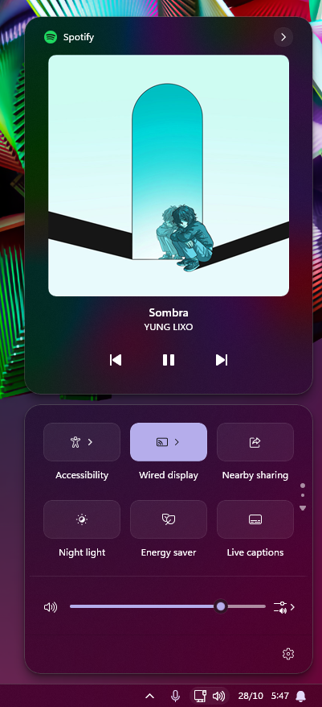

  ---

  ## General Information

  [Work in Progress]

  ---

  ## Manual installation

  The theme styles can also be imported manually. To do that, follow these steps:

  * Open the Windows 11 Taskbar Styler mod in Windhawk.
  * Go to the "Settings" tab and select "Textual mode".
  * Copy the content below to the text box and click "Save settings".

  <details>
  <summary>Content to import (click to expand)</summary>

  ```yaml
  styleConstants:
    - mbg=<WindhawkBlur BlurAmount="30" TintColor="{ThemeResource CardStrokeColorDefaultSolid}" TintOpacity="0.0" TintLuminosityOpacity="1.0" TintSaturation="1.0" NoiseDensity="1.0" NoiseOpacity="0.1" />
    - bcr=10
    - bbb=#13FFFFFF
    - wcr=20
    - mcr=15
    - t=Transparent
    - bb=#20FFFFFF
    - bt=1
    - mbt=#10FFFFFF
    - mbth=#15FFFFFF
    - mbtp=#15FFFFFF
  controlStyles:
    - target: Grid#NotificationCenterGrid
      styles:
        - Background:=$mbg
        - CornerRadius=$wcr
        - BorderThickness=$bt
        - BorderBrush=$bb
        - Shadow:=
    - target: Grid#NotificationCenterTopBanner
      styles:
        - CornerRadius=$wcr
        - Margin=5,6,5,0
    - target: Windows.UI.Xaml.Controls.Grid#RootGrid > Windows.UI.Xaml.Controls.ContentPresenter#ContentPresenter
      styles:
        - CornerRadius=18
        - Margin=0,0,0,0
    - target: Windows.UI.Xaml.Controls.Grid > Windows.UI.Xaml.Controls.Border#ItemOpaquePlating
      styles:
        - CornerRadius=$mcr
        - BorderBrush:=$t
        - Shadow:=
    - target: Grid#CalendarCenterGrid
      styles:
        - Background:=$mbg
        - CornerRadius=$wcr
        - BorderThickness=$bt
        - BorderBrush=$bb
        - Shadow:=
    - target: ScrollViewer#CalendarControlScrollViewer
      styles:
        - Background:=$t
        - BorderBrush:=$t
    - target: Border#CalendarHeaderMinimizedOverlay
      styles:
        - Background:=$t
    - target: ActionCenter.FocusSessionControl#FocusSessionControl > Grid#FocusGrid
      styles:
        - Background:=$t
        - BorderBrush:=$t
    - target: Windows.UI.Xaml.Controls.Grid#ControlCenterRegion
      styles:
        - Background:=$mbg
        - CornerRadius=$wcr
        - BorderThickness=$bt
        - BorderBrush=$bb
        - Shadow:=
    - target: ScrollViewer#ListContent
      styles:
        - Background:=$t
        - BorderBrush:=$t
    - target: Windows.UI.Xaml.Controls.Grid#L1Grid > Border
      styles:
        - Background:=$t
        - BorderBrush:=$t
    - target: Windows.UI.Xaml.Controls.ContentPresenter
      styles:
        - CornerRadius=$bcr
    - target: Windows.UI.Xaml.Controls.Primitives.Thumb#HorizontalThumb > Windows.UI.Xaml.Controls.Border
      styles:
        - Background:= <AcrylicBrush TintColor="{ThemeResource CardStrokeColorDefaultSolid}" FallbackColor="{ThemeResource CardStrokeColorDefaultSolid}" TintOpacity="0.5" TintLuminosityOpacity="1.0" Opacity="1"/>
    - target: Grid#MediaTransportControlsRegion
      styles:
        - Background:=$mbg
        - CornerRadius=$wcr
        - BorderThickness=$bt
        - BorderBrush=$bb
        - Height=470
        - Shadow:=
    - target: Windows.UI.Xaml.Controls.Grid#MediaTransportControlsRegion
      styles:
        - Height=470
    - target: Windows.UI.Xaml.Controls.Grid#AlbumTextAndArtContainer
      styles:
        - Height=347
    - target: Windows.UI.Xaml.Controls.Grid#ThumbnailImage
      styles:
        - Width=300
        - Height=300
        - HorizontalAlignment=Center
        - VerticalAlignment=Top
        - Grid.Column=1
        - Margin=0,2,0,0
    - target: Windows.UI.Xaml.Controls.Grid#ThumbnailImage > Windows.UI.Xaml.Controls.Border
      styles:
        - CornerRadius=10
    - target: Windows.UI.Xaml.Controls.StackPanel#PrimaryAndSecondaryTextContainer
      styles:
        - VerticalAlignment=Bottom
        - Grid.Column=0
    - target: Windows.UI.Xaml.Controls.StackPanel#PrimaryAndSecondaryTextContainer > Windows.UI.Xaml.Controls.TextBlock#TitleText
      styles:
        - TextAlignment=Center
    - target: Windows.UI.Xaml.Controls.StackPanel#PrimaryAndSecondaryTextContainer > Windows.UI.Xaml.Controls.TextBlock#SubtitleText
      styles:
        - TextAlignment=Center
    - target: Grid#MediaTransportControlsRoot
      styles:
        - Background:=<SolidColorBrush Color="Transparent"/>
    - target: MenuFlyoutPresenter
      styles:
        - CornerRadius:=$mcr
        - BorderThickness:=$bt
        - BorderBrush:=$bb
        - Shadow:=
    - target: Border#JumpListRestyledAcrylic
      styles:
        - Background:=$mbg
        - CornerRadius:=$mcr
        - BorderThickness=$bt
        - BorderBrush=$bb
        - Shadow:=
    - target: Border#ToastBackgroundBorder2
      styles:
        - Background:=$mbg
        - BorderThickness=$bt
        - BorderBrush:=$bb
        - CornerRadius=$wcr
        - Shadow:=
    - target: Border#ToastBackgroundBorder
      styles:
        - Background:=$mbg
        - BorderThickness=$bt
        - BorderBrush:=$bb
        - CornerRadius=$wcr
        - Shadow:=
    - target: Windows.UI.Xaml.Controls.ToolTip > Windows.UI.Xaml.Controls.ContentPresenter#LayoutRoot
      styles:
        - Background:=$mbg
        - CornerRadius=13
        - BorderThickness=$bt
        - BorderBrush=$bb
        - Shadow:=
    - target: Windows.UI.Xaml.Controls.Grid#FooterGrid
      styles:
        - BorderBrush:=$t
    - target: ActionCenter.MultiLineTextBox#Edit
      styles:
        - CornerRadius=$bcr
    - target: Windows.UI.Xaml.Controls.MenuFlyoutItem
      styles:
        - CornerRadius=$bcr
    - target: Windows.UI.Xaml.Controls.MenuFlyoutSubItem
      styles:
        - CornerRadius=$bcr
    - target: Windows.UI.Xaml.Controls.ListViewItem
      styles:
        - CornerRadius=$bcr
    - target: Windows.UI.Xaml.Controls.ContentPresenter#PageHeader
      styles:
        - Background:=$t
    - target: Windows.UI.Xaml.Controls.ContentPresenter > Windows.UI.Xaml.Controls.Border
      styles:
        - BorderBrush:=$t
    - target: Windows.UI.Xaml.Controls.Primitives.ListViewItemPresenter#Root > Border
      styles:
        - CornerRadius=$bcr
    - target: Windows.UI.Xaml.Controls.Primitives.RepeatButton#PreviousButton > Windows.UI.Xaml.Controls.ContentPresenter#ContentPresenter@CommonStates
      styles:
        - Background@Normal:=$mbt
        - Background@PointerOver:=$mbth
        - Background@Pressed:=$mbtp
        - RenderTransform:=<TranslateTransform X="15" Y="0" />
        - BorderBrush=$bbb
        - BorderThickness@Normal=$bt
        - BorderThickness@PointerOver=$bt
        - BorderThickness@Pressed=$bt
    - target: Windows.UI.Xaml.Controls.Button#PlayPauseButton > Windows.UI.Xaml.Controls.ContentPresenter#ContentPresenter@CommonStates
      styles:
        - Background@Normal:=$mbt
        - Background@PointerOver:=$mbth
        - Background@Pressed:=$mbtp
        - Width=110
        - BorderBrush=$bbb
        - BorderThickness@Normal=$bt
        - BorderThickness@PointerOver=$bt
        - BorderThickness@Pressed=$bt
    - target: Windows.UI.Xaml.Controls.Primitives.RepeatButton#NextButton > Windows.UI.Xaml.Controls.ContentPresenter#ContentPresenter@CommonStates
      styles:
        - Background@Normal:=$mbt
        - Background@PointerOver:=$mbth
        - Background@Pressed:=$mbtp
        - RenderTransform:=<TranslateTransform X="-15" Y="0" />
        - BorderBrush=$bbb
        - BorderThickness@Normal=$bt
        - BorderThickness@PointerOver=$bt
        - BorderThickness@Pressed=$bt
    - target: Windows.UI.Xaml.Shapes.Rectangle#HorizontalTrackRect
      styles:
        - Fill:=$bbb
    - target: MenuFlyoutPresenter > Border
      styles:
        - Background:=$mbg
    - target: ScrollViewer#MenuFlyoutPresenterScrollViewer > Border > Grid > ScrollContentPresenter > ItemsPresenter > StackPanel
      styles:
        - ChildrenTransitions:=<TransitionCollection><EntranceThemeTransition IsStaggeringEnabled="True" FromHorizontalOffset="-50" FromVerticalOffset="50" /></TransitionCollection>
    - target: Windows.UI.Xaml..Controls.Grid#JumpListGrid > Windows.UI.Xaml.Controls.Grid#SystemItemsContainer > Windows.UI.Xaml.Controls.Border > JumpViewUI.SystemItemListView#SystemItemList > Windows.UI.Xaml.Controls.StackPanel
      styles:
        - ChildrenTransitions:=<TransitionCollection><EntranceThemeTransition IsStaggeringEnabled="True" FromHorizontalOffset="-50" FromVerticalOffset="50" /></TransitionCollection>
    - target: Grid#LayoutRoot
      styles:
        - BackgroundTransition:=<BrushTransition Duration="0:0:0.100" />
    - target: Border#BackgroundBorder
      styles:
        - BackgroundTransition:=<BrushTransition Duration="0:0:0.100" />
    - target: Border#BackgroundBorder
      styles:
        - BackgroundTransition:=<BrushTransition Duration="0:0:0.100" />
    - target: Border#BackgroundBorder
      styles:
        - BackgroundTransition:=<BrushTransition Duration="0:0:0.100" />
    - target: Windows.UI.Xaml.Controls.Grid#FocusGrid
      styles:
        - Background:=$t
        - BorderBrush:=$t
    - target: ControlCenter.ControlCenterView#ControlCenterView > Windows.UI.Xaml.Controls.Grid#RootGrid > Windows.UI.Xaml.Controls.Border#RootGridBorder > Windows.UI.Xaml.Controls.Grid#L1Grid > Windows.UI.Xaml.Controls.Border > Windows.UI.Xaml.Controls.ContentControl#TogglesGroup > Windows.UI.Xaml.Controls.ContentPresenter > ControlCenter.PaginatedGridView > Windows.UI.Xaml.Controls.Grid > Windows.UI.Xaml.Controls.GridView#RootGridView > Windows.UI.Xaml.Controls.Border > Windows.UI.Xaml.Controls.ScrollViewer#ScrollViewer > Windows.UI.Xaml.Controls.Border#Root > Windows.UI.Xaml.Controls.Grid > Windows.UI.Xaml.Controls.ScrollContentPresenter#ScrollContentPresenter > Windows.UI.Xaml.Controls.ItemsPresenter
      styles:
        - Height=50
  ```
  </details>
</details>

&nbsp;

## **📁 File Explorer** | **0.1.3** | ⚠️ Heavy Work in Progress 

<details>
<summary>(click to expand)</summary>

  <details>
  <summary>Changelog</summary>

  **Added**

  - Command bar separator. (0.1.2)
  - Command bar separator and Home tab transparency guides. (0.1.2)

  **Fixed**

  - Home tab transparency was removed due to issues with other tabs' contents appearing behind Home contents in some situations. (0.1.2)
  - Removed previous `0.1.2` Home background styling having the same issue.

  **Known Issues**

  - No Home and Gallery transparency
  - Infinite Issues

  </details>

  

  ---

  ## General Information

  [Work in Progress]

  ---

  ## Guides

  ### Disable Command Bar Separator

  <details>
  <summary>Click to expand guide</summary>

  To disable the command bar separator, change `CommandBarDivider` from `1` to `0`.

  Like this: `CommandBarDivider=0`

  </details>

  &nbsp;

  ### Home Tab Transparency

  **Note:** Home tab transparency was removed due to issues with other tabs' contents appearing behind Home contents in some situations. If you still want to enable it, follow the guide below.

  Alternatively, if you don't use Home tab features, you can set "**Open File Explorer to**" to `This PC` in File Explorer's settings, which is fully transparent.

  <details>
  <summary>Click to expand guide</summary>

  To re-enable Home tab transparency, you can either edit the content manually or add it through the UI settings.

  **Option 1**

  Add these lines at the very end of the content:

  ```yaml
    - target: Microsoft.UI.Xaml.Controls.Grid#HomeViewRootGrid
      styles:
        - Background:=$t
  ```

  <details>
  <summary>Example</summary>
  
  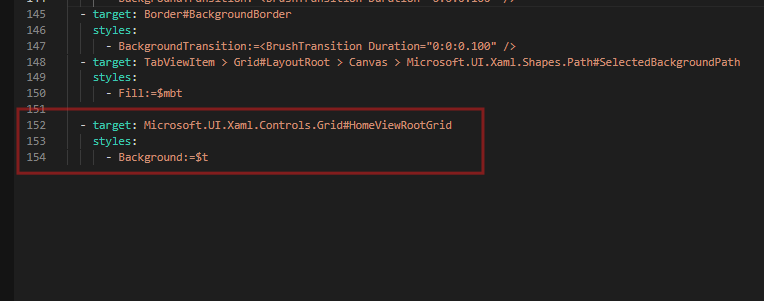

  </details>

  &nbsp;

  **Option 2**

  1. Open **Windows 11 File Explorer Styler** settings and scroll to the bottom.
  2. Above **Resource variables**, click **Add new item**.
  3. Set **Target** to:
  `Microsoft.UI.Xaml.Controls.Grid#HomeViewRootGrid`
  4. Set **Styles** to:
  `Background:=$t`
  5. Click **Save settings** at the top.

  <details>
  <summary>Example</summary>

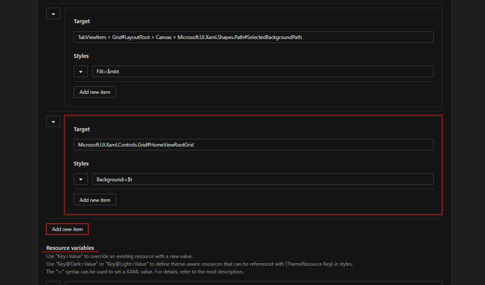
  
  </details>

  </details>

  &nbsp;

  ---

  ## Known Issues

  I didn't know how to fix these. I couldn't find the correct target names, or I'm not sure if they can even be changed.

  - Tooltips have no Acrylic
  - Context menus doesn't have matching border radius
  - Some Context menus doesn't have matching border brushes
  - Context menus doesn't have matching backdrop
  - Context menus inside context menus doesn't match anything

  ---

  ## Manual installation

  The theme styles can also be imported manually. To do that, follow these steps:

  * Open the Windows 11 Taskbar Styler mod in Windhawk.
  * Go to the "Settings" tab and select "Textual mode".
  * Copy the content below to the text box and click "Save settings".

  <details>
  <summary>Content to import (click to expand)</summary>

  ```yaml
  styleConstants:
    - CommandBarDivider=1
    - mbg=<AcrylicBrush TintColor="{ThemeResource CardStrokeColorDefaultSolid}" FallbackColor="{ThemeResource CardStrokeColorDefaultSolid}" TintOpacity="0.0" TintLuminosityOpacity="1.0" Opacity="1"/>
    - bcr=10
    - bbb=#13FFFFFF
    - wcr=20
    - mcr=15
    - t=Transparent
    - bb=#20FFFFFF
    - bt=1
    - mbt=#10FFFFFF
    - mbth=#15FFFFFF
    - mbtp=#15FFFFFF
  controlStyles:
    - target: TabViewItem > Grid#LayoutRoot
      styles:
        - CornerRadius=10
    - target: Button#AddButton
      styles:
        - RenderTransform:=<TranslateTransform X="0" Y="-1" />
    - target: Microsoft.UI.Xaml.Controls.Border#BottomBorderLine
      styles:
        - Visibility=Collapsed
    - target: Grid#TabContainerGrid > Border#LeftBottomBorderLine
      styles:
        - Visibility=Collapsed
    - target: Grid#TabContainerGrid > Border#RightBottomBorderLine
      styles:
        - Visibility=Collapsed
    - target: Microsoft.UI.Xaml.Controls.Grid#NavigationBarControlGrid
      styles:
        - Background:=$t
    - target: Microsoft.UI.Xaml.Controls.Grid#PART_LayoutRoot
      styles:
        - ''
    - target: Microsoft.UI.Xaml.Controls.AutoSuggestBox#FileExplorerSearchBox > Microsoft.UI.Xaml.Controls.Grid#LayoutRoot > Microsoft.UI.Xaml.Controls.TextBox#TextBox
      styles:
        - ''
    - target: Microsoft.UI.Xaml.Controls.Grid#CommandBarControlRootGrid
      styles:
        - Background:=$t
        - BorderBrush:=$bb
        - BorderThickness=0,0,0,$CommandBarDivider
    - target: Microsoft.UI.Xaml.Controls.CommandBar#FileExplorerCommandBar
      styles:
        - Background:=$t
        - RenderTransform:=<TranslateTransform X="0" Y="-5" />
        - HorizontalAlignment=Center
    - target: Microsoft.UI.Xaml.Controls.CommandBar#FileExplorerSecondaryCommandBar > Microsoft.UI.Xaml.Controls.Grid#LayoutRoot > Microsoft.UI.Xaml.Controls.Grid#ContentRoot
      styles:
        - Visibility=Collapsed
    - target: Microsoft.UI.Xaml.Controls.Grid#HomeViewRootGrid
      styles:
        - CornerRadius=0
    - target: FileExplorerExtensions.GalleryViewControl - GalleryViewControl
      styles:
        - Visibility=Collapsed
    - target: FileExplorerExtensions.GalleryViewControl#GalleryViewControl > Grid
      styles:
        - Background:=$t
    - target: TabViewItem > Grid#LayoutRoot
      styles:
        - CornerRadius=$mcr
        - BorderThickness=0
        - BorderBrush=$t
    - target: Button#CloseButton
      styles:
        - CornerRadius=$bcr
    - target: Button#AddButton
      styles:
        - CornerRadius=$bcr
    - target: TabViewItem > Grid#LayoutRoot@CommonStates
      styles:
        - Background@Normal:=$t
        - Background@PointerOver:=#02FFFFFF
        - Background@Selected:=#05FFFFFF
        - Background@PointerOverSelected:=$mbth
        - Background@PressedSelected:=$mbth
    - target: Microsoft.UI.Xaml.Controls.Grid#PART_LayoutRoot
      styles:
        - CornerRadius=14
        - BorderBrush:=$bbb
    - target: Microsoft.UI.Xaml.Controls.Primitives.ToggleButton#PART_RootChevronButton
      styles:
        - CornerRadius=$bcr
    - target: Microsoft.UI.Xaml.Controls.TextBox - TextBox > Microsoft.UI.Xaml.Controls.Grid > Microsoft.UI.Xaml.Controls.Border#BorderElement > Microsoft.UI.Xaml.Controls.ScrollViewer#ContentElement > Microsoft.UI.Xaml.Controls.Border#Root > Microsoft.UI.Xaml.Controls.Grid > Microsoft.UI.Xaml.Controls.ScrollContentPresenter#ScrollContentPresenter > Microsoft.UI.Xaml.Internal.TextBoxView
      styles:
        - RenderTransform:=<TranslateTransform X="0" Y="1" />
    - target: Microsoft.UI.Xaml.Controls.Primitives.ToggleButton#PART_RootChevronButton
      styles:
        - CornerRadius=8
    - target: Microsoft.UI.Xaml.Controls.AutoSuggestBox#FileExplorerSearchBox > Microsoft.UI.Xaml.Controls.Grid#LayoutRoot > Microsoft.UI.Xaml.Controls.TextBox#TextBox
      styles:
        - Background:=$mbt
        - CornerRadius=$mcr
        - BorderBrush:=$bbb
        - Margin=0,-0.3,0,-0.75
    - target: Microsoft.UI.Xaml.Controls.Button#MoreButton > Microsoft.UI.Xaml.Controls.Grid@CommonStates
      styles:
        - CornerRadius@PointerOver:=$bcr
        - CornerRadius@Pressed:=$bcr
    - target: MenuFlyoutPresenter > Border
      styles:
        - BorderThickness:=$bt
        - BorderBrush:=$bb
        - CornerRadius:=$mcr
    - target: MenuFlyoutPresenter
      styles:
        - BorderThickness:=$bt
        - BorderBrush:=$bb
        - CornerRadius:=$mcr
    - target: Microsoft.UI.Xaml.Controls.Primitives.CommandBarFlyoutCommandBar
      styles:
        - BorderThickness:=$bt
        - BorderBrush:=$bb
        - CornerRadius:=$mcr
    - target: Microsoft.UI.Xaml.Controls.RadioMenuFlyoutItem
      styles:
        - CornerRadius=$bcr
    - target: Microsoft.UI.Xaml.Controls.Border#AppBarButtonInnerBorder
      styles:
        - CornerRadius=$bcr
    - target: Microsoft.UI.Xaml.Controls.MenuFlyoutItem
      styles:
        - CornerRadius=$bcr
    - target: Microsoft.UI.Xaml.Controls.MenuFlyoutSubItem
      styles:
        - CornerRadius=$bcr
    - target: ToolTip
      styles:
        - Background:=$mbg
        - CornerRadius:=$mcr
        - BorderThickness:=$bt
        - BorderBrush:=$bb
    - target: Microsoft.UI.Xaml.Controls.Primitives.CommandBarFlyoutCommandBar > Grid#LayoutRoot > Grid#OuterContentRoot > Grid#ContentRoot > Grid#PrimaryItemsRoot
      styles:
        - ''
    - target: ScrollViewer#MenuFlyoutPresenterScrollViewer > Border > Grid > ScrollContentPresenter > ItemsPresenter > StackPanel
      styles:
        - ChildrenTransitions:=<TransitionCollection><EntranceThemeTransition IsStaggeringEnabled="True" FromHorizontalOffset="-50" FromVerticalOffset="50" /></TransitionCollection>
    - target: Grid#LayoutRoot
      styles:
        - BackgroundTransition:=<BrushTransition Duration="0:0:0.100" />
    - target: Border#BackgroundBorder
      styles:
        - BackgroundTransition:=<BrushTransition Duration="0:0:0.100" />
    - target: TabViewItem > Grid#LayoutRoot > Canvas > Microsoft.UI.Xaml.Shapes.Path#SelectedBackgroundPath
      styles:
        - Fill:=$mbt
  ```

  </details>
</details>
