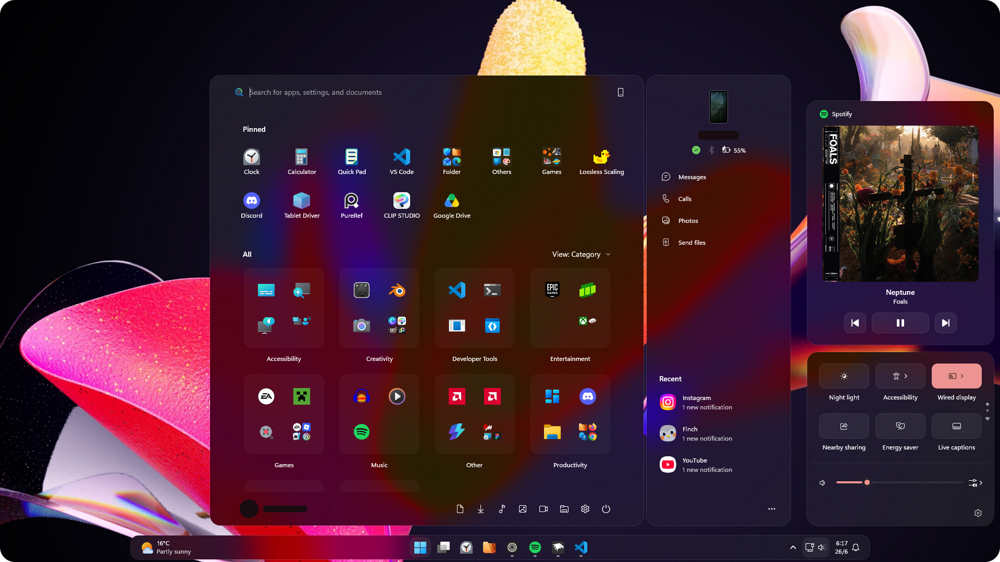

## Luminosity Windows 11 Theme Pack (Beta)
Early access to the Luminosity updates. They may contain issues and messy code. Luminosity is a theme pack for Windhawk's Windows 11 Styler mods.

# ⚠️ Beta Warning
**This is a Beta release.**
While the themes have been tested, they are not final. Expect issues, unfinished features, and visual inconsistencies. Feedback is appreciated!

Theme JSON is up to date, but README information likely isn't!

## ✨ Luminosity Taskbar 1.2 ✨

(click to expand)

	
### General Changes:

- Multiple `TaskbarFrame` fixes by [**m417z**](https://github.com/m417z)
    - Now compatible with multiple taskbar setups!! (multiple displays)
- Fixed missing Background in some elements
- Better documentation and guides
- Better settings; easier to change thingies
- Revamped Task View and Alt+Tab
    - New visuals (inside limitations)
    - Better Virtual Desktops bar width behavior
- Hover effects from [Fluid](https://github.com/ramensoftware/windows-11-start-menu-styling-guide/tree/main/Themes/Fluid) on Window Preview buttons
- `SystemTray` fixes and simplification
- Reorganized some target placment
- Specified some vague targets
- Overflow icon now have styling
- Removed gap between widget and taskbar icons for extra space
    - Can be disabled
    - Not available for Classic variant by default
- Restored Snap Layouts Bar position to make the top more accessible
- Basic styling to Input Switcher
    - Couldn’t find targets to make buttons rounded as well

**Dock**

- Neat top gap idea I got from a [Reddit post from u/OCometa](https://www.reddit.com/r/Windhawk/comments/1t3x8n9/how_can_i_nudge_the_taskbar_a_few_pixels_down_or/) to better separate maximized window and dock
- Added a small gap between taskbar icons and system tray to access Right-Click Menu.

### What’s Next?

Updates will take a long while now, as I need to focus on work. I’m planning a revamp for this `README.md` to make things easier to navigate through and maintain.

After that I’ll move toward Taskbar v2 and finish support for the old Start Menu while I still have access to it. The idea for v2 is bringing more changes, and options that users can just drop into the `yaml` after the main code. Some planned optional ideas are:

- Bigger window previews
- Bigger buttons for various things
- Task View and Alt+Tab variations

Some ideas are still theoretical/experimental and might not even be possible because of unknown limitations.

Occasionally I might also revisit Notification Center, since it currently doesn’t fully match the rest of the theme pack visually and needs some fixes/improvements. I'm keeping the older version of Luminosity's Start Menu since it better match with the current Notification Center.

## ✨ Basic styling for the [redesigned Windows 11 Start menu](https://microsoft.design/articles/start-fresh-redesigning-windows-start-menu/)! ✨

(click to expand)

Choose the version `0.3`! should also be compatible with the old Start Menu and will replace `0.2` when ready.

## Credits

(click to expand)

- [WindowGlass](https://github.com/Nathaniel4JC/Windows-11-Taskbar-Styler/tree/main/Themes/WindowGlass) - A few targets
- [Fluid](https://github.com/ramensoftware/windows-11-start-menu-styling-guide/tree/main/Themes/Fluid) - Right-Click and mouse hovering animations.

## Installation Guide

Content to Install (click to expand)

To apply the theme, you will need:
- [Windhawk](https://windhawk.net/) (Of course)

### Required Windhawk Mods
**Taskbar**
- [Windows 11 Taskbar Styler](https://windhawk.net/mods/windows-11-taskbar-styler)
  
  **Required for Compact Taskbar**
  - [Taskbar Labels for Windows 11](https://windhawk.net/mods/taskbar-labels)
  - [Taskbar Clock Customization](https://windhawk.net/mods/taskbar-clock-customization)

**Start Menu**
- [Windows 11 Start Menu Styler](https://windhawk.net/mods/windows-11-start-menu-styler)

**Notification / Action Center**
- [Windows 11 Notification Center Styler](https://windhawk.net/mods/windows-11-notification-center-styler)

**File Explerer**
- [Windows 11 File Explorer Styler](https://windhawk.net/mods/windows-11-file-explorer-styler)

**Recommended**
- [Translucent Windows](https://windhawk.net/mods/translucent-windows) (use Mica or MicaAlt)

---

# Introduction

**Luminosity** is based on Windows's native Acrylic, using the maximum `TintLuminosityOpacity` value as its backdrop and more rounded UI elements.

It's meant to work well on dark windows, with **Mica** or **MicaAlt** backdrops, with or without the **Translucent Windows** mod.

---

## Theme Status
| Component                         | Version   | Status              | Notes                            |
| --------------------------------- | --------- | ------------------- | -------------------------------- |
| **Taskbar**                       | **1.2** | ✅ Working fine | Available on Windhawk |
| **Start Menu**                    | **0.2.2** / **0.3**| 🔧 Work in Progress | Outdated screenshots  |
| **Notification / Control Center** | **0.1.1** | 🔧 Work in Progress | Messy code, missing styles, outdated screenshots       |
| **File Explorer**                 | **0.1.1** | ⚠️ Heavy WIP        | Messy code, multiple issues      |

---

# 📜 Changelog

(Click to expand)

*All notable changes to this project will be documented in this file.*

This changelog follows **[Keep a Changelog](https://keepachangelog.com/en/1.0.0/)** and uses **Semantic Versioning**.

---

# Planned

### Taskbar
- Virtual Desktops Right-Click menus.

### Start Menu
- Is passing through a complete rewrite, many hovering effects from [Fluid](https://github.com/ramensoftware/windows-11-start-menu-styling-guide/tree/main/Themes/Fluid) are planned to be added here.

### Notification / Action Center
- Attempt to add missing JumpLists menu animations, and maybe remove more separation borders in other areas of the Action Center (Wired Display & Project).

### File Explorer
- Attempt to remove drop shadows and add matching corner radius and borders to more XAML elements.
	- I believe I can't add the Luminosity backdrop.

---

# Theme-Specific Versions

## **Taskbar**

### **[1.2] – Current**

**Status:** 🔧 Work in Progress

**Added**

Refer to top of the page

**Fixed**

Refer to top of the page

**Known Issues**

N/A

---

## **Start Menu**

### **[0.2.2]/[0.3 Early Access] – Current**

**Status:** Work in Progress

**Added**

- 0.2.2 - Fixed transparency issues in some Windows versions (changed AcrylicBrush to WindhawkBlur)
- 0.2.2 - Convert JSON to YAML (textual mode settings)
- 0.3 - Basic styling for the [redesigned Windows 11 Start menu](https://microsoft.design/articles/start-fresh-redesigning-windows-start-menu/)! 

**Known Issues**

* Missing screenshots.
* Some UI elements not themed yet

---

## **Notification / Control Center**

### **[0.1.1] – Current**

**Status:** Work in Progress

**Added**

* Fixed transparency issues in some Windows versions (changed `AcrylicBrush` to `WindhawkBlur`)
* Removed mentions to nonexistent options
* Convert JSON to YAML (textual mode settings)

**Known Issues**

* Visual issues in lower screen resolutions.
* Messy code.
* Some UI elements not themed yet.

---

## **File Explorer**

### **[0.1.1] – Current**

**Status:** Heavy Work in Progress

**Added**

* Beetter Toolbar spacing for when using without Translucent Windows

**Known Issues**

* Multiple visual issues.
* Messy code.
